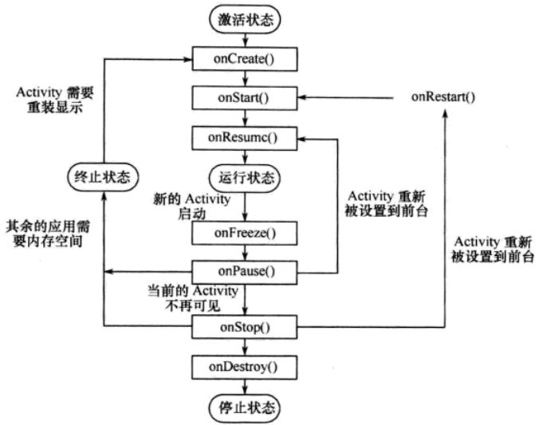

# ___2013 - 07 - 09（Android开发）___
***

# Q / A
  - cat /data/misc/wifi/wpa_supplicant.conf就可以看到所有保存的wifi热点的密码信息
  - Android中TED视频下载路径：SD卡/Android/data/com.ted.android/files
***

# 更改Android虚拟机分辨率
  - 关闭虚拟机的状态下
    ```shell
    cd /usr/lib/virtualbox
    # 查看当前所有可用的虚拟机
    ./VBoxManage list vsm
    # 向Android中添加480x640x16分辨率
    ./VBoxManage setextradata "Android" "CustomVideoMode1" "480x640x16"
    ```
  - 启动Android虚拟机
    - 在启动画面选中选项后按'e'键，在kernel行上按'e'键编辑内核启动参数
    - 增加一个参数 vga=ask，编辑完毕后按回车保存修改结果
    - 这时会回到上一个页面，此时按下'b'键启动，按照系统提示选择需要的分辨率启动即可
***

# adb使用
  - 使用adb连接android虚拟机：
    ```shell
    Android虚拟机中Alt + F1 启动控制台：
        ifconfig eth0 192.168.7.217
        dhcpcd eth0
        netcfg
    ```
    shell中
    ```shell
    adb connect 192.168.7.217
    ```
    其他命令
    ```shell
    adb shell  # 打开android设备根目录
    ```
  - 在Android x86虚拟机下安装.apk应用程序
    - 首先将.apk文件下载到本地
    - 运行命令adb push {PATH/test.apk} /sdcard/
    - 安装：adb install test.apk，或者直接在虚拟机里面点击.apk文件进行安装
***

# Ubuntu下反编译apk文件
  - 需要用到的工具
    - [apktool](http://code.google.com/p/android-apktool/downloads/list)
    - [dex2jar](http://code.google.com/p/dex2jar/downloads/list)
    - [JD-GUI](http://java.decompiler.free.fr/?q=jdgui)
    - 下载后分别解压
  - 运行命令
    ```shell
    cd [apktool路径]        # 或将其路径加入到环境变量
    apktool d [apk路径]     # 得到同名文件夹，即可进入查看xml及图片等资源
    cd [dex2jar路径]        # 不可使用环境变量的方法
    sh dex2jar.sh [apk路径] # 得到[apk文件名]_dex2jar.jar文件
                           # 还可将apk文件解压得到class.dex文件，代替apk文件

    cd [JD-GUI路径]         # 或将其路径加入到环境变量
    jd-gui [dex2jar得到的jar文件]  # 不能有中文
    ```
***

# android 平台采用了软件堆层架构,主要分为四部分
  - **底层**，linux2.6内核为基础，并包含各种驱动模型，直接操作硬件(c/汇编)
  - **中间层**
    - 本地库 c/c++
    - 运行时环境
    - DVM(java虚拟机Dalvix Virtual Machine)
    - java核心库 IO
  - **framework框架层** android java API 类库
  - **应用层**，捆绑核心应用，包括通话程序、短信程序等
***

# DVM与JVM不同
  - JVM采用堆栈型(访问内存)，DVM 采用寄存器型 ARM RISC 大量寄存器
  - 解释器 Jazelle java加速技术 有汇编支持
  - java代码打包成dex文件
  - 安全性 一个应用采用单进程但虚拟机实例
***

# 通常一个Android应用程序由4个组件构成
  - 活动(Activity) 意图(Intent) 服务(Service) 和内容提供器(Content Provider)
  - 除了Activity是必须组件之外，其余组件都是可选的
  - **活动** 最基本的Android应用程序组件
    - 在应用程序中，一个活动通常就是一个单独的屏幕
    - 每个活动都是通过继承活动基类(android.app.Acticity)被实现为一个独立的类
    - 活动类将会显示由视图控件组成的用户接口，并对事件做出响应
  - **意图** 用来描述应用程序想做什么
    - 是一种运行时绑定机制，能在程序运行的过程中连接两个不同的组件
    - 与Intent相关的两个类是IntentFilter和IntentReceiver
    - InetFilter用于描述一个活动或者广播接收器能够操作哪些Inet
    - IntentReciever可使应用程序对外部事件做出响应
  - **服务** 后台运行，但不能自己运行，需要用某一个Activity来调用
  - **内容提供器** 提供一种多应用间数据共享的方式
    - 一个内容提供器类实现了一组标准的方法
    - 能够让其他的应用保存或读取此内容提供器处理的各种数据类型
***

# Eclipse中Android项目架构
  - **src文件夹** 存放项目中的源文件
  - **gen文件夹** 包含一个创建项目时自动生成的R.java只读文件，其中包含很多的静态类，用来表示项目中所有的资源引用
  - **Android x.x文件夹** 包含android.jar文件，其中包含所有的Android SDK库和APIs
  - **assets文件夹** 包含使用到的视频和音频文件，编译时不在R.java中生成资源索引
  - **res文件夹** 资源目录，向此目录添加资源文件时，会被R.java自动记录，其中
    - 三个drawabel开头的文件夹中包应用程序中使用的图标
    - layout文件夹包含界面布局文件main.xml
    - values文件夹中包含程序中要使用到的字符串引用文件string.xml
  - **AndroidManifest.xml文件**：项目的总配置文件，用来配置应用中所使用的各种组件， 定义的程序组件必须注册到清单文件中，
  - **default.properties文件**：负责记录项目所需要的环境信息，如Andoid版本信息等
***

# Andoid中的Acticity
  - 多个Activity类可以用同一个Activity栈来进行管理
    - 当一个新的Activity启动的时候，它首先会被放置在Activity栈顶并成为运行状态的Activity
    - 只有当这个新的Activity退出(BackKey)之后，之前的Activity才能重新回到前台界面
  - Activity共有四种状态
    - 激活或者运行状态，此时运行在屏幕的前台
    - 暂停状态，此时Activity失去焦点，但是仍对用户可见
    - 停止状态，此时Activity被其他Activity覆盖而完全变暗
    - 终止状态，此时被系统清理出内存
    
  - **完整生命周期**
    - 从最初调用onCreat()到最终调用onDestroy()的整个过程
    - onCreat()用于设置Activity中所有全局状态以初始化系统资源
    - onDestroy()用于释放所有系统资源
  - **可见生命周期**
    - 从调用onStart()到调用对应onStop()的这个过程
    - 在此期间，用户可以维护Activity在显示时所需的资源，可被多次调用
  - **前台生命周期**
    - 从调用onResume()到调用对应onPause()为止的这个过程
    - 在此期间，当前Activity处于其他所有Activity的前面，可以与用户交互
  - **onCreate()方法** 使用Bundle对象作为参数，Bundle类用于在不同的Activity之间传递参数，通常需要结合intent类来实现不同Activity之间的交互
  - 在调用onCreate()方法后通常会调用 **setContentView(int)** 方法设置UI布局，并使用 **findViewById(int)** 修改在XML中定义的View组件属性
***

# Activity的两种界面设计方式
  - **基于XML的方式**，通过编辑res/layout目录下的XML文件activity_main.xml实现
  - **直接使用代码来创建界面组件**，与普通java程序一样使用代码设计，注意删除掉activity_main.xml的对应项，以及setContentView(R.layout.main)。
***

# acitivity_main.xml中常用项
  - **andoid:layout_width** 定义元素布局的宽度
    - fill_parent表示宽度与父元素相同
    - wrap_content表示宽度随组件本身的内容调整
    - 或直接通过指定px值来设置宽度
  - **android:layout_height** 定义元素法高度
  - **android:id** 定义在R.java中该对象的唯一标识
    ```java
    android:id="@+id/myTextViewID"
    ```
***

# 用户人机界面由视图、视图容器、布局等组件构成
  - Andoid的窗体功能是通过Widget类实现的
  - **视图组件(View)对象** 存储Andoid屏幕上的一个特定的矩形区域的布局和内容属性的数据体
  - **视图容器组件(ViewGroup)** View的容器，可将View添加进来，也可加入到另外一个ViewGroup
  - **布局组件(Layout)**
    - LinearLayout线性布局
    - TableLayout(表格布局)
    - RelativeLayout(相对布局)
    - AbsoluteLayout(绝对布局)
  - **布局参数(LayoutParams)** 用来设置视图布局的基类，只是描述视图的宽度和高度，其他的布局类都是LayoutPapams的子类，可实现更复杂的布局
***

# Android中采用alpha+RGB来提供颜色方案
  - 需要使用4个字节来表示颜色，前一个字节是alpha值表示透明度，后面三个字节表示RGB值
  - Android有两种使用颜色的方法
  - **Color类** 提供了常见的12种颜色常量，如红色0xFFFF0000/绿色0xFF00FF00/蓝色0xFF0000FF
  - **Drawable标签** 通过指定颜色的值生成颜色常量，从而获得任意的颜色
    ```java
    <drawable name="BLUE">#FF0000FF</dwawable>
    并通过以下语句引用该资源：
    Resources resource = this.getBaseContext().getResources();
    final Drawable blue_Drawable = resource.getDrawable(R.drawable.BLUE);
    ```
***

# Android中的适配器
  - 使由于接口不兼容而不能交互的类一起工作，主要的适配器类型有三种
  - **ArrayAdapter** 把数据放入一个数组中以便显示
  - **SimpleCursorAdapter** 数据库应用相关的适配器
  - **SimpleAdapter** 可定义多种布局，包括ImageView/Button/Checkbox
  - 调用 **createFromResource()** 方法生成适配器
***

# 常用Widget组件
  - **文本框视图(TextView)**
    - 不可编辑的文本框，往往用来在屏幕中显示静态字符串
    - 其子类包括：Button, CheckedTextView, Chronometer, DigitalClock, EditText
  - **按钮(Button)**
    - 通过实现setOnClickListener()方法设置单击监听方法
    - 在OnClickListener()方法引用外部定义的Button对象时，这些对象需要被声明为final常量
  - **图片按钮(ImageButton)**
    - 通过android:src属性或setImageResource()方法指定ImageButton显示的图片
    - 通过使用setOnTouchLietener()方法实现事件监听方式
  - **编辑框(EditText)**
    - TextView的子类，用户与系统之间的文本输入接口
    - 通过使用setOnEditorAction()方法定义编辑时监听方法
    - 通过属性android:imeOptions设置键盘的Enter键响应方式，取值包括：
      - actionSearch放大镜图标
      - actionNone移到下一行
      - actionGo
      - actionSend
      - actionNext
  - **复选框(Checkbox)**
    - 通过使用setOnCheckedChangeListener()方法来检测状态的改变
  - **浮窗(Toast)**
    - 通过使用Toast.makeText()方法来设置消息的显示字符串以及持续时间
    - 通过使用setGravity()方法来设置信息在屏幕上的位置
  - **单项选择(RadioGroup)**
    - 其中的单选按钮为RadioButton类
    - 通过使用setOnCheckedChangeListener()方法来检测状态的改变
  - **下拉列表(Spinner)**
    - AbsSpinner的子类
    - 通过使用setOnItemSelectedListener()方法设置下拉列表子项被选中的监听器
  - **自动完成文本框图(AutoCompleteTextView)**
    - 是EditText类的子类，提供自动完成文本功能
    - 当使用AutoCompleteTextView时，必须提供一个 MultiComletetextView.Tokenizer 对象以用来区分不同的字串
  - **日期选择器(DatePicker)**
    - 通过使用setOnDateChangedListener()注册日期改变监听器
  - **时间选择器(TimePicker)**
    - 通过使用setOnTimeChangedListener()注册时间改变监听器
  - **数字时钟(DigitalClock)**
    - TextView的子类，提供了两个窗体事件的响应方法，不建议使用
    - onAttachedToWindow()，当视图附加到窗体时调用，视图将开始绘制用于显示的界面，要保证该方法之前被调用了onDraw(Canvas)方法
    - onDetachedFromWindow()，从窗体分离事件的响应方法
  - **模拟时钟(AnalogClock)**
    - android.view.View的子类
  - **进度条(Progressbar)**
    - 通过setVisibility()设置可见性
    - setProgress()设置进度值
    - setMax()设置进度最大值
  - **拖动条(SeekBar)**
    - ProgressBar的子类
    - 通过使用setOnSeekBarChangeListener()方法注册拖动条监听器
    - 需要实现监听器的onProgressChanged() / onStartTrackingTouch() / onStopTrackingTouch()方法
    - 注意onProgressChanged()方法中的返回值progress计算时需先乘以100，否则容易造成结果为0
  - **评分条(RatingBar)**
    - 基于SeekBar与ProgressBar的扩展
    - 使用时需将控件宽度设置为 wrap_content 才能正确显示
    - 通过使用getOnRatingBarChangedListener()方法设置该组件的事件监听器
***

# Android中的视图组件
  - **图片视图(ImageView)**
    - ImageButton类的父类
    - 通过 setOnTouchListener() 来设置 ImageButton 单击事件监听器
  - **滚动视图(ScrollView)**
  - **网格视图(GridView)**
  - **切换图片(ImageSwither&Gallery)**
***

# 清单文件
  - 在manifest根标记下有如下几个标记：
    ```java
    <uses-permition>        应用授权，如：访问sd卡/拨号程序/传感器/网络
    <permssion>        限制其他程序访问本程序组件
    <instrumentation>        测试
    <application>        放置activity/service/provider/receiver
    ```
***

# Activity通信方式
  - 利用intent对象来实现
  - 利用键值对来传送数据
    - 写数据 putExtra(String key,Xxx value)
    - 读数据 getXxxExtra(String key)
  - 利用Bundle对象来打包键值对
    - 打包数据 putXxx(String key,Xxx value)
    - 使用 intent方法putExtras(Bundle) 传送数据包
    - 使用 intent方法getExtras() 方法接收数据包
    - 解数据 getXxx(String key)
***

# Android中的Service
  - Service不能自己运行，需要同过一个Activity或其他Context对象来调用
    - Context.startService()/Context.bindService()两种方式启动Service
    - 当不特别指定不是独立的线程,在main线程中运行
  - 启用一个新的LocalService步骤
    - 定义一个继承Service的类，并在AndroidManifest.xml文件中添加对应的Service引用；
    - 重写Service的声明周期方法，如果在Service的onCreat或onStart做一些很耗时的动作，最好另启动一个线程来运行这个Service
    - 如果要被调用的是bindService(View)/unbindService(View)方法，则应在相应Activity中定义一个ServiceConnection类的对象，其作用是将Activity和特定的Sservice连接在一起，共同生存，具有共同的声明周期
    - 在调用Activity中定义Intent来启动相应的 startService(View) / stopService(View) 方法，或是 bindService(View) / unbindService(View) 方法
***

# Service的声明周期
  - 通过startService启动
    - 首先创建时调用一次onCreate()，onStart() / onStartCommand()可调用多次
    - 直到调用者调用stopService()方法，Service进入onDestroy()即停止运行
    - 如果调用者退出时没有调用stopService()，则Service会移植在后台运行
  - 通过bindService启动
    - onCreate()在绑定时如果Service没有创建则会自动创建，并调用一次onBind()方法
    - 此时不能直接调用stopService()方法，而只能调用unbindService()方法停止服务运行
    - 如果调用者退出，则Service会调用onUnbind() --> onDestroy()停止运行
***
