# ___2019 - 11 - 18 Keras Insightface___
***

# 目录
  <!-- TOC depthFrom:1 depthTo:6 withLinks:1 updateOnSave:1 orderedList:0 -->

  - [___2019 - 11 - 18 Keras Insightface___](#2019-11-18-keras-insightface)
  - [目录](#目录)
  - [Test functions](#test-functions)
  	- [Decode mxnet log](#decode-mxnet-log)
  	- [Choose accuracy](#choose-accuracy)
  	- [Remove regular loss from total loss](#remove-regular-loss-from-total-loss)
  	- [Multi GPU losses test](#multi-gpu-losses-test)
  	- [Temp test](#temp-test)
  	- [Face recognition test](#face-recognition-test)
  	- [Replace ReLU with PReLU in mobilenet](#replace-relu-with-prelu-in-mobilenet)
  	- [Convolution test](#convolution-test)
  - [Model conversion](#model-conversion)
  	- [ONNX](#onnx)
  	- [TensorRT](#tensorrt)
  	- [TFlite](#tflite)
  - [ResNet and ResNeSt and EfficientNet](#resnet-and-resnest-and-efficientnet)
  	- [ResNet101V2](#resnet101v2)
  	- [ResNeSt101](#resnest101)
  	- [EfficientNetB4](#efficientnetb4)
  	- [ResNet34 CASIA](#resnet34-casia)
  	- [MXNet record](#mxnet-record)
  - [Mobilenet on Emore](#mobilenet-on-emore)
  	- [Mobilenet batch size 256 on Emore](#mobilenet-batch-size-256-on-emore)
  	- [Mobilenet batch size 1024 on Emore](#mobilenet-batch-size-1024-on-emore)
  	- [Mobilenet batch size 1024 on Emore testing cosine learning rate](#mobilenet-batch-size-1024-on-emore-testing-cosine-learning-rate)
  	- [Mobilenet batch size 1024 on Emore testing soft center triplet combination](#mobilenet-batch-size-1024-on-emore-testing-soft-center-triplet-combination)
  	- [Mobilenet testing centerloss](#mobilenet-testing-centerloss)
  	- [Mobilenet testing SGDW](#mobilenet-testing-sgdw)
  	- [Mobilefacenet](#mobilefacenet)
  	- [Mobilefacenet SE](#mobilefacenet-se)
  - [Mobilenet on CASIA](#mobilenet-on-casia)
  	- [Combination of adamw and label smoothing and dropout on cifar10](#combination-of-adamw-and-label-smoothing-and-dropout-on-cifar10)
  	- [Combination of adamw and dropout and centerloss and triplet on CASIA](#combination-of-adamw-and-dropout-and-centerloss-and-triplet-on-casia)
  	- [Combination of nesterov and label smoothing and dropout on CASIA](#combination-of-nesterov-and-label-smoothing-and-dropout-on-casia)
  	- [Sub center Result](#sub-center-result)
  	- [Distillation Result](#distillation-result)
  - [IJB](#ijb)
  - [Ali Datasets](#ali-datasets)

  <!-- /TOC -->
***

# Test functions
## Decode mxnet log
  ```py
  import json

  def decode_mxnet_log(src_file, dest_file=None):
      with open(src_file, 'r') as ff:
          aa = ff.readlines()

      losses = [ii.strip() for ii in aa if 'Train-lossvalue=' in ii]
      losses = [float(ii.split('=')[-1]) for ii in losses]

      accs = [ii.strip() for ii in aa if 'Train-acc=' in ii]
      accs = [float(ii.split('=')[-1]) for ii in accs]

      lfws = [ii.strip() for ii in aa if 'Accuracy-Flip:' in ii and 'lfw' in ii]
      lfws = [float(ii.split(': ')[-1].split('+-')[0]) for ii in lfws]

      cfp_fps = [ii.strip() for ii in aa if 'Accuracy-Flip:' in ii and 'cfp_fp' in ii]
      cfp_fps = [float(ii.split(': ')[-1].split('+-')[0]) for ii in cfp_fps]

      agedb_30s = [ii.strip() for ii in aa if 'Accuracy-Flip:' in ii and 'agedb_30' in ii]
      agedb_30s = [float(ii.split(': ')[-1].split('+-')[0]) for ii in agedb_30s]

      lrs = [0.1] * 20 + [0.01] * 10 + [0.001] * (len(losses) - 20 - 10)

      bb = {
          "loss": losses,
          "accuracy": accs,
          "lr": lrs,
          "lfw": lfws,
          "cfp_fp": cfp_fps,
          "agedb_30": agedb_30s,
      }

      print({kk:len(bb[kk]) for kk in bb})

      if dest_file == None:
          dest_file = os.path.splitext(src_file)[0] + '.json'
      with open(dest_file, 'w') as ff:
          json.dump(bb, ff)
      return dest_file

  decode_mxnet_log('r34_wdm1_lazy_false.log')
  ```
## Decode TF log
  ```py
  import json

  def evals_split_func(aa, eval_name):
      evals = [ii.strip() for ii in aa if eval_name + ' evaluation' in ii]
      accs = [float(ii.split(', thresh:')[0].split(':')[-1].strip()) for ii in evals]
      threshs = [float(ii.split(', thresh:')[1].split(',')[0].strip()) for ii in evals]
      return accs, threshs

  def decode_TF_log(src_file, dest_file=None):
      with open(src_file, 'r') as ff:
          aa = ff.readlines()

      loss_accs = [ii.strip() for ii in aa if 's/step' in ii and 'loss' in ii]
      losses = [float(ii.split('loss:')[1].split('-')[0]) for ii in loss_accs]
      accs = [float(ii.split('accuracy:')[1].split('-')[0]) for ii in loss_accs]
      lrs = [float(ii.strip().split('is')[-1].strip()) for ii in aa if 'Learning rate' in ii]

      lfw_accs, lfw_threshs = evals_split_func(aa, "lfw")
      cfp_fp_accs, cfp_fp_threshs = evals_split_func(aa, "cfp_fp")
      agedb_30_accs, agedb_30_threshs = evals_split_func(aa, "agedb_30")

      bb = {
          "loss": losses,
          "accuracy": accs,
          "lr": lrs,
          "lfw": lfw_accs,
          "cfp_fp": cfp_fp_accs,
          "agedb_30": agedb_30_accs,
          "lfw_thresh": lfw_threshs,
          "cfp_fp_thresh": cfp_fp_threshs,
          "agedb_30_thresh": agedb_30_threshs,
      }

      print({kk:len(bb[kk]) for kk in bb})

      if dest_file == None:
          dest_file = os.path.splitext(src_file)[0] + '.json'
      with open(dest_file, 'w') as ff:
          json.dump(bb, ff)
      return dest_file

  decode_TF_log('TT_mobilenet_MSEDense_margin_softmax_sgdw_5e4_emb256_dr0_bs400_hist.foo')
  ```
## Choose accuracy
  ```py
  import json

  def choose_accuracy(aa):
      evals = ['lfw', 'cfp_fp', 'agedb_30']
      dd_agedb_max, dd_all_max, dd_sum_max = {}, {}, {}
      for pp in aa:
          with open(pp, 'r') as ff:
              hh = json.load(ff)
          nn = os.path.splitext(os.path.basename(pp))[0]
          agedb_arg_max = np.argmax(hh['agedb_30'])
          dd_agedb_max[nn] = {kk: hh[kk][agedb_arg_max] for kk in evals}
          dd_agedb_max[nn]["epoch"] = int(agedb_arg_max)

          dd_all_max[nn] = {kk: "%.4f, %2d" % (max(hh[kk]), np.argmax(hh[kk])) for kk in evals}
          # dd_all_max[nn] = {kk: max(hh[kk]) for kk in evals}
          # dd_all_max[nn].update({kk + "_epoch": np.argmax(hh[kk]) for kk in evals})

          sum_arg_max = np.argmax(np.sum([hh[kk] for kk in evals], axis=0))
          dd_sum_max[nn] = {kk: hh[kk][sum_arg_max] for kk in evals}
          dd_sum_max[nn]["epoch"] = int(sum_arg_max)

      names = ["agedb max", "all max", "sum max"]
      for nn, dd in zip(names, [dd_agedb_max, dd_all_max, dd_sum_max]):
          print()
          print(">>>>", nn, ":")
          # print(pd.DataFrame(dd).T.to_markdown())
          print(pd.DataFrame(dd).T)
  ```
## Remove regular loss from total loss
  ```py
  import json

  def remove_reg_loss_from_hist(src_hist, dest_hist=None):
      with open(src_hist, 'r') as ff:
          aa = json.load(ff)
      aa['loss'] = [ii - jj for ii, jj in zip(aa['loss'], aa['regular_loss'])]
      if dest_hist == None:
          dest_hist = os.path.splitext(src_hist)[0] + "_no_reg.json"
      with open(dest_hist, 'w') as ff:
          json.dump(aa, ff)
      return dest_hist

  remove_reg_loss_from_hist('checkpoints/NNNN_resnet34_MXNET_E_REG_BN_SGD_1e3_lr1e1_random0_arcT4_S32_E1_BS512_casia_3_hist.json')
  ```
## Multi GPU losses test
  ```py
  sys.path.append('..')
  import losses, train, models
  with tf.distribute.MirroredStrategy().scope():
      basic_model = models.buildin_models("MobileNet", dropout=0.4, emb_shape=256)
      tt = train.Train('faces_emore_test', save_path='temp_test.h5', eval_paths=['lfw.bin'], basic_model=basic_model, lr_base=0.001, batch_size=16, random_status=3)
      sch = [
          {"loss": losses.MarginSoftmax(), "epoch": 2},
          {"loss": losses.ArcfaceLoss(), "triplet": 10, "epoch": 2},
          {"loss": losses.MarginSoftmax(), "centerloss": 20, "epoch": 2},
          {"loss": losses.ArcfaceLoss(), "centerloss": 10, "triplet": 20, "epoch": 2},
          {"loss": losses.BatchAllTripletLoss(0.3), "alpha": 0.1, "epoch": 2},
          {"loss": losses.BatchHardTripletLoss(0.25), "centerloss": 10, "triplet": 20, "epoch": 2},
          {"loss": losses.CenterLoss(num_classes=5, emb_shape=256), "epoch": 2},
          {"loss": losses.CenterLoss(num_classes=5, emb_shape=256), "triplet": 10, "epoch": 2}
      ]
      tt.train(sch)
  ```
## Temp test
  ```py
  sys.path.append('..')
  import losses, train, models
  import tensorflow_addons as tfa
  basic_model = models.buildin_models("MobileNet", dropout=0, emb_shape=256)
  tt = train.Train('faces_emore_test', save_path='temp_test.h5', eval_paths=['lfw.bin'], basic_model=basic_model, batch_size=16)
  optimizer = tfa.optimizers.AdamW(learning_rate=0.001, weight_decay=5e-5)
  tt.train_single_scheduler(loss=losses.MarginSoftmax(), epoch=2, optimizer=optimizer)

  sch = [
      {"loss": losses.MarginSoftmax(), "epoch": 2},
      {"loss": losses.ArcfaceLoss(), "triplet": 10, "epoch": 2},
      {"loss": losses.MarginSoftmax(), "centerloss": 20, "epoch": 2},
      {"loss": losses.ArcfaceLoss(), "centerloss": 10, "triplet": 20, "epoch": 2},
      {"loss": losses.BatchAllTripletLoss(0.3), "alpha": 0.1, "epoch": 2},
      {"loss": losses.BatchHardTripletLoss(0.25), "centerloss": 10, "triplet": 20, "epoch": 2},
      {"loss": losses.CenterLoss(num_classes=5, emb_shape=256), "epoch": 2},
      {"loss": losses.CenterLoss(num_classes=5, emb_shape=256), "triplet": 10, "epoch": 2}
  ]
  tt.my_evals[-1].save_model = None
  tt.basic_callbacks.pop(1) # NOT saving
  tt.basic_callbacks.pop(-1) # NO gently_stop
  tt.train(sch)

  sch = [
      {"loss": losses.ArcfaceLoss(), "embLossTypes": "triplet", "embLossWeights": 10, "epoch": 2},
      {"loss": losses.MarginSoftmax(), "embLossTypes": "centerloss", "embLossWeights": 20, "epoch": 2},
      {"loss": losses.ArcfaceLoss(), "embLossTypes": ["centerloss", "triplet"], "embLossWeights": [10, 20], "epoch": 2},
      {"loss": losses.BatchHardTripletLoss(0.25), "embLossTypes": ["centerloss", "triplet"], "embLossWeights": [10, 20], "epoch": 2},
      {"loss": losses.CenterLoss(num_classes=5, emb_shape=256), "embLossTypes": "triplet", "embLossWeights": 10, "epoch": 2}
  ]
  tt.train(sch)

  tt.reset_dataset('faces_emore_test_shuffle_label_embs_normed_256.npz')

  sch = [
    {"loss": losses.MarginSoftmax(), "epoch": 2, "distill": 10},
    {"loss": losses.ArcfaceLoss(), "epoch": 2, "distill": 10, "centerloss": 10},
    {"loss": losses.CenterLoss(num_classes=5, emb_shape=256), "epoch": 2, "distill": 10},
    {"loss": losses.BatchAllTripletLoss(), "epoch": 2, "distill": 10},
    {"loss": losses.distiller_loss_cosine, "epoch": 2},
    {"loss": losses.distiller_loss_cosine, "centerloss": 20, "epoch": 2},
    {"loss": losses.distiller_loss_cosine, "triplet": 20, "epoch": 2},
  ]
  tt.train(sch)

  tt.reset_dataset('faces_emore_test_shuffle_label_embs_normed_512.npz')
  tt.train(sch[:3])

  mm = keras.models.load_model('../checkpoints/keras_mobilenet_emore_adamw_5e5_soft_baseline_before_arc_E80_BTO_E2_arc_MSEtrip_auto_alpha_basic_agedb_30_epoch_112_0.958167.h5')
  mm.trainable = False
  tt = train.Train('faces_emore_test', save_path='temp_test.h5', eval_paths=['lfw.bin'], basic_model=basic_model, batch_size=16, teacher_model_interf=mm)
  ```
## Face recognition test
  ```py
  import glob2
  import insightface
  from sklearn.preprocessing import normalize
  from skimage import transform

  def face_align_landmarks_sk(img, landmarks, image_size=(112, 112), method='similar'):
      tform = transform.AffineTransform() if method == 'affine' else transform.SimilarityTransform()
      src = np.array([[38.2946, 51.6963], [73.5318, 51.5014], [56.0252, 71.7366], [41.5493, 92.3655], [70.729904, 92.2041]], dtype=np.float32)
      ret = []
      for landmark in landmarks:
          # landmark = np.array(landmark).reshape(2, 5)[::-1].T
          tform.estimate(landmark, src)
          ret.append(transform.warp(img, tform.inverse, output_shape=image_size))
      return (np.array(ret) * 255).astype(np.uint8)

  imms = glob2.glob('./*.jpg')
  imgs = [imread(ii)[:, :, :3] for ii in imms]
  det = insightface.model_zoo.face_detection.retinaface_r50_v1()
  det.prepare(-1)
  idds = {nn: ii for nn, ii in zip(imms, imgs)}
  dds = {nn: det.detect(ii[:, :, ::-1]) for nn, ii in zip(imms, imgs)}

  nimgs = np.array([face_align_landmarks_sk(idds[kk], vv[1])[0] for kk, vv in dds.items() if len(vv[1]) != 0])
  plt.imshow(np.hstack(nimgs))
  plt.tight_layout()
  nimgs_norm = (nimgs[:, :, :, :3] - 127.5) / 127

  ''' Keras model '''
  mm = keras.models.load_model("../Keras_insightface/checkpoints/mobilenet_emore_tests/mobilenet_adamw_BS256_E80_arc_tripD_basic_agedb_30_epoch_123_0.955333.h5")
  mm = keras.models.load_model("../Keras_insightface/checkpoints/resnet101/TF_resnet101v2_E_sgdw_5e5_dr4_lr1e1_random0_arc32_E5_arc_BS512_emore_basic_agedb_30_epoch_20_batch_2000_0.973000.h5")
  mm = keras.models.load_model("../Keras_insightface/checkpoints/resnest101/keras_ResNest101_emore_II_basic_agedb_30_epoch_64_0.968500.h5")

  ees = normalize(mm(nimgs_norm))
  np.dot(ees, ees.T)

  ''' MXNet model '''
  sys.path.append('../Keras_insightface/')
  from data_distiller import Mxnet_model_interf
  mm = Mxnet_model_interf('../tdFace-flask.mxnet/subcenter-arcface-logs/r100-arcface-msfdrop75/model,0')
  ees = normalize(mm(nimgs))
  np.dot(ees, ees.T)

  [kk for kk, vv in dds.items() if len(vv[1]) != 0]

  mm = face_model.FaceModel()
  ees = normalize(mm.interp(nimgs_norm))
  ```
  ```py
  mmns = [
      "T_mobilenetv3L_adamw_5e5_arc_trip64_BS1024_basic_agedb_30_epoch_125_batch_2000_0.953833.h5",
      "T_mobilenet_adamw_5e5_arc_trip64_BS1024_basic_agedb_30_epoch_114_batch_4000_0.952000.h5",
      "mobilenet_adamw_BS256_E80_arc_tripD_basic_agedb_30_epoch_123_0.955333.h5",
      "keras_se_mobile_facenet_emore_triplet_basic_agedb_30_epoch_100_0.958333.h5",
      "keras_se_mobile_facenet_emore_IV_basic_agedb_30_epoch_48_0.957833.h5",
  ]
  for mmn in mmns:
      mm = keras.models.load_model("../Keras_insightface/checkpoints/" + mmn)
      ees = normalize(mm(nimgs_norm))
      np.dot(ees, ees.T)
      print(">>>>", mmn)
      print(np.dot(ees, ees.T))
  ```
## Replace ReLU with PReLU in mobilenet
  ```py
  def convert_ReLU(layer):
      # print(layer.name)
      if isinstance(layer, keras.layers.ReLU):
          print(">>>> Convert ReLU:", layer.name)
          return keras.layers.PReLU(shared_axes=[1, 2], name=layer.name)
      return layer

  mm = keras.applications.MobileNet(include_top=False, input_shape=(112, 112, 3), weights=None)
  mmn = keras.models.clone_model(mm, clone_function=convert_ReLU)
  ```
## Convolution test
  ```py
  inputs = tf.ones([1, 3, 3, 1])
  conv_valid = tf.keras.layers.Conv2D(1, 2, strides=2, padding='valid', use_bias=False, kernel_initializer='ones')
  conv_same = tf.keras.layers.Conv2D(1, 2, strides=2, padding='same', use_bias=False, kernel_initializer='ones')
  pad = keras.layers.ZeroPadding2D(padding=1)
  print(conv_valid(inputs).shape, conv_same(inputs).shape, conv_valid(pad(inputs)).shape)
  # (1, 1, 1, 1) (1, 2, 2, 1) (1, 2, 2, 1)

  print(inputs.numpy()[0, :, :, 0].tolist())
  # [[1.0, 1.0, 1.0],
  #  [1.0, 1.0, 1.0],
  #  [1.0, 1.0, 1.0]]
  print(conv_same(inputs).numpy()[0, :, :, 0].tolist())
  # [[4.0, 2.0],
  #  [2.0, 1.0]]
  print(conv_valid(pad(inputs)).numpy()[0, :, :, 0].tolist())
  # [[1.0, 2.0],
  #  [2.0, 4.0]]
  print(pad(inputs).numpy()[0, :, :, 0].tolist())
  # [[0.0, 0.0, 0.0, 0.0, 0.0],
  #  [0.0, 1.0, 1.0, 1.0, 0.0],
  #  [0.0, 1.0, 1.0, 1.0, 0.0],
  #  [0.0, 1.0, 1.0, 1.0, 0.0],
  #  [0.0, 0.0, 0.0, 0.0, 0.0]]
  ```
  ```py
  data = mx.symbol.Variable("data", shape=(1, 1, 3, 3))
  ww = mx.symbol.Variable("ww", shape=(1, 1, 2, 2))
  cc = mx.sym.Convolution(data=data, weight=ww, no_bias=True, kernel=(2, 2), stride=(2, 2), num_filter=1, pad=(1, 1))

  aa = mx.nd.ones([1, 1, 3, 3])
  bb = mx.nd.ones([1, 1, 2, 2])
  ee = cc.bind(mx.cpu(), {'data': aa, 'ww': bb})
  print(ee.forward()[0].asnumpy()[0, 0].tolist())
  # [[1.0, 2.0],
  #  [2.0, 4.0]]
  ```
## Cosine and Euclidean Distance
  ```py
  xx = np.arange(8).reshape(2, 4).astype('float')
  yy = np.arange(1, 17).reshape(4, 4).astype('float')

  # Normalize
  from sklearn.preprocessing import normalize
  aa = normalize(xx)
  bb = xx / np.expand_dims(np.sqrt((xx ** 2).sum(1)), 1)
  print(np.allclose(aa, bb))
  # True

  # Cosine Distance
  aa = np.dot(normalize(xx), normalize(yy).T)
  bb = np.dot(xx, yy.T) / (np.sqrt((xx ** 2).sum(1)).reshape(-1, 1) * np.sqrt((yy ** 2).sum(1)))
  print(np.allclose(aa, bb))
  # True

  # Euclidean Distance
  aa = np.stack([np.sqrt(((yy - ii) ** 2).sum(1)) for ii in xx])
  bb = np.sqrt((xx ** 2).sum(1).reshape(-1, 1) + (yy ** 2).sum(1) - np.dot(xx, yy.T) * 2)
  print(np.allclose(aa, bb))
  # True

  # TF
  x2 = tf.reduce_sum(tf.square(xx), axis=-1, keepdims=True)
  y2 = tf.reduce_sum(tf.square(yy), axis=-1)
  xy = tf.matmul(xx, tf.transpose(yy))
  cc = tf.sqrt(x2 + y2 - 2 * xy).numpy()
  print(np.allclose(aa, bb, cc))
  # True
  ```
  ```py
  cos_dd = np.dot(normalize(xx), normalize(yy).T)
  euc_dd = np.stack([np.sqrt(((yy - ii) ** 2).sum(1)) for ii in xx])
  sum_xx = (xx ** 2).sum(1).reshape(-1, 1)
  sum_yy = (yy ** 2).sum(1)

  print(np.allclose(euc_dd, np.sqrt(sum_xx + sum_yy - 2 * cos_dd * np.sqrt(sum_xx * sum_yy))))
  print(np.allclose(euc_dd ** 2 / 2 * -1, cos_dd * np.sqrt(sum_xx * sum_yy) - (sum_xx + sum_yy) / 2))
  # True
  print(np.allclose(cos_dd, (sum_xx + sum_yy - euc_dd ** 2) / (2 * np.sqrt(sum_xx * sum_yy))))
  # True
  ```
  ```py
  xx * yy - sqrt(xx ** 2 * yy ** 2) --> xx * yy / xx * yy
  xx * yy - (xx ** 2 + yy ** 2) / 2
    ==> set yy == xx, scale xx == xx * aa
    ==> aa * xx * xx - (aa ** 2 * xx ** 2 + xx ** 2) / 2
    ==> (aa - (aa ** 2 + 1) / 2) * xx ** 2
  ```
## Summary print function
  ```py
  def print_total_params_only(model):
      aa = []
      model.summary(print_fn=lambda xx: aa.append(xx) if 'params:' in xx else None)
      # print(aa)
      return aa
  ```
***

# Model conversion
## ONNX
  - `tf2onnx` convert `saved model` to `tflite`, support `tf1.15.0`
    ```py
    tf.__version__
    # '1.15.0'

    # Convert to saved model first
    import glob2
    mm = tf.keras.models.load_model(glob2.glob('./keras_mobilefacenet_256_basic_*.h5')[0], compile=False)
    tf.keras.experimental.export_saved_model(mm, './saved_model')
    # tf.contrib.saved_model.save_keras_model(mm, 'saved_model') # TF 1.13

    ! pip install -U tf2onnx
    ! python -m tf2onnx.convert --saved-model ./saved_model --output model.onnx
    ```
  - [keras2onnx](https://github.com/onnx/keras-onnx)
    ```py
    ! pip install keras2onnx

    import keras2onnx
    import glob2
    mm = tf.keras.models.load_model(glob2.glob('./keras_mobilefacenet_256_basic_*.h5')[0], compile=False)
    onnx_model = keras2onnx.convert_keras(mm, mm.name)
    keras2onnx.save_model(onnx_model, 'mm.onnx')
    ```
## TensorRT
  - [Atom_notebook TensorRT](https://github.com/leondgarse/Atom_notebook/blob/master/public/2019/08-19_tensorrt.md)
## TFlite
  - Convert to TFlite
    ```py
    tf.__version__
    # '1.15.0'

    import glob2
    converter = tf.lite.TFLiteConverter.from_keras_model_file("checkpoints/keras_se_mobile_facenet_emore_triplet_basic_agedb_30_epoch_100_0.958333.h5")
    tflite_model = converter.convert()
    open('./model.tflite', 'wb').write(tflite_model)
    ```
    ```py
    tf.__version__
    # '2.1.0'

    import glob2
    mm = tf.keras.models.load_model(glob2.glob('./keras_mobilefacenet_256_basic_*.h5')[0], compile=False)
    converter = tf.lite.TFLiteConverter.from_keras_model(mm)
    tflite_model = converter.convert()
    open('./model_tf2.tflite', 'wb').write(tflite_model)
    ```
  - interpreter test
    ```py
    tf.__version__
    # '2.1.0'

    import glob2
    interpreter = tf.lite.Interpreter('./model.tflite')
    interpreter.allocate_tensors()
    input_index = interpreter.get_input_details()[0]["index"]
    output_index = interpreter.get_output_details()[0]["index"]

    def tf_imread(file_path):
        img = tf.io.read_file(file_path)
        img = tf.image.decode_jpeg(img, channels=3)
        img = tf.image.convert_image_dtype(img, tf.float32)
        img = (img - 0.5) * 2
        return tf.expand_dims(img, 0)

    imm = tf_imread('/datasets/faces_emore_112x112_folders/0/1.jpg')
    # imm = tf_imread('./temp_test/faces_emore_test/0/1.jpg')
    interpreter.set_tensor(input_index, imm)
    interpreter.invoke()
    aa = interpreter.get_tensor(output_index)[0]

    def foo(imm):
        interpreter.set_tensor(input_index, imm)
        interpreter.invoke()
        return interpreter.get_tensor(output_index)[0]
    %timeit -n 100 foo(imm)
    # 36.7 ms ± 471 µs per loop (mean ± std. dev. of 7 runs, 100 loops each)

    mm = tf.keras.models.load_model(glob2.glob('./keras_mobilefacenet_256_basic_*.h5')[0], compile=False)
    bb = mm(imm).numpy()
    assert np.allclose(aa, bb, rtol=1e-3)
    %timeit mm(imm).numpy()
    # 71.6 ms ± 213 µs per loop (mean ± std. dev. of 7 runs, 10 loops each)
    ```
  - **On ARM64 board**
    ```sh
    lscpu
    # Architecture:        aarch64

    python --version
    # Python 3.6.9

    sudo apt install python3-pip ipython cython3
    pip install ipython

    git clone https://github.com/noahzhy/tf-aarch64.git
    cd tf-aarch64/
    pip install tensorflow-1.9.0rc0-cp36-cp36m-linux_aarch64.whl
    pip install https://dl.google.com/coral/python/tflite_runtime-2.1.0.post1-cp36-cp36m-linux_aarch64.whl
    ```
    ```py
    import tensorflow as tf
    tf.enable_eager_execution()
    tf.__version__
    # 1.9.0-rc0

    import tflite_runtime
    tflite_runtime.__version__
    # 2.1.0.post1

    import tflite_runtime.interpreter as tflite
    interpreter = tflite.Interpreter('./mobilefacenet_tf2.tflite')
    interpreter.allocate_tensors()
    input_index = interpreter.get_input_details()[0]["index"]
    output_index = interpreter.get_output_details()[0]["index"]

    imm = tf.convert_to_tensor(np.ones([1, 112, 112, 3]), dtype=tf.float32)
    interpreter.set_tensor(input_index, imm)
    interpreter.invoke()
    out = interpreter.get_tensor(output_index)[0]

    def foo(imm):
        interpreter.set_tensor(input_index, imm)
        interpreter.invoke()
        return interpreter.get_tensor(output_index)[0]
    %timeit -n 100 foo(imm)
    # 42.4 ms ± 43.1 µs per loop (mean ± std. dev. of 7 runs, 100 loops each)

    %timeit -n 100 foo(imm) # EfficientNetB0
    # 71.2 ms ± 52.5 µs per loop (mean ± std. dev. of 7 runs, 100 loops each)
    ```
  - **Wapper trained model with `Rescale` / `L2_normalize`**
    ```py
    mm2 = keras.Sequential([
        keras.layers.Input((112, 112, 3)),
        keras.layers.experimental.preprocessing.Rescaling(1./127.5, offset=-1),
        mm,
        keras.layers.Lambda(tf.nn.l2_normalize, name='norm_embedding', arguments={'axis': 1})
    ])
    ```
    ```py
    mm2 = keras.Sequential([
        keras.layers.Input((112, 112, 3), dtype='uint8'),
        keras.layers.Lambda(lambda xx: (xx / 127) - 1),
        # keras.layers.experimental.preprocessing.Rescaling(1./127.5, offset=-1),
        mm,
        # keras.layers.Lambda(tf.nn.l2_normalize, name='norm_embedding', arguments={'axis': 1}),
        keras.layers.Lambda(lambda xx: tf.cast(xx / tf.sqrt(tf.reduce_sum(xx ** 2)) * 255, 'uint8')),
        # keras.layers.Lambda(lambda xx: tf.cast(xx * 255, 'uint8')),
    ])
    ```
    ```py
    inputs = keras.layers.Input([112, 112, 3])
    nn = (inputs - 127.5) / 128
    nn = mm(nn)
    nn = tf.divide(nn, tf.expand_dims(tf.sqrt(tf.reduce_sum(tf.pow(nn, 2), -1)), -1))
    bb = keras.models.Model(inputs, nn)
    ```
  - **Dynamic input shape**
    ```py
    mm3 = keras.Sequential([
        keras.layers.Input((None, None, 3)),
        keras.layers.experimental.preprocessing.Resizing(112 ,112),
        keras.layers.experimental.preprocessing.Rescaling(1./127.5, offset=-1),
        mm,
        keras.layers.Lambda(tf.nn.l2_normalize, name='norm_embedding', arguments={'axis': 1})
    ])

    converter = tf.lite.TFLiteConverter.from_keras_model(mm3)
    tflite_model = converter.convert()
    open('./norm_model_tf2.tflite', 'wb').write(tflite_model)

    interpreter = tf.lite.Interpreter('./norm_model_tf2.tflite')
    input_index = interpreter.get_input_details()[0]["index"]
    output_index = interpreter.get_output_details()[0]["index"]

    interpreter.resize_tensor_input(input_index, (1, 512, 512, 3))
    interpreter.allocate_tensors()
    interpreter.set_tensor(input_index, tf.ones([1, 512, 112, 3], dtype='float32'))
    interpreter.invoke()
    out = interpreter.get_tensor(output_index)[0]
    ```
  - **Integer-only quantization**
    ```py
    def tf_imread(file_path):
        img = tf.io.read_file(file_path)
        img = tf.image.decode_jpeg(img, channels=3)
        img = tf.image.convert_image_dtype(img, tf.float32)
        img = (img - 0.5) * 2
        return tf.expand_dims(img, 0)

    def representative_data_gen():
        for input_value in tf.data.Dataset.from_tensor_slices(image_names).batch(1).take(100):
            yield [tf_imread(input_value[0])]

    aa = np.load('faces_emore_112x112_folders_shuffle.pkl', allow_pickle=True)
    image_names, image_classes = aa["image_names"], aa["image_classes"]

    mm = tf.keras.models.load_model("checkpoints/keras_se_mobile_facenet_emore_triplet_basic_agedb_30_epoch_100_0.958333.h5", compile=False)
    converter = tf.lite.TFLiteConverter.from_keras_model(mm)
    converter.optimizations = [tf.lite.Optimize.DEFAULT]
    converter.representative_dataset = representative_data_gen
    # Ensure that if any ops can't be quantized, the converter throws an error
    converter.target_spec.supported_ops = [tf.lite.OpsSet.TFLITE_BUILTINS_INT8]
    # Set the input and output tensors to uint8 (APIs added in r2.3)
    converter.inference_input_type = tf.uint8
    converter.inference_output_type = tf.uint8

    tflite_model_quant = converter.convert()
    interpreter = tf.lite.Interpreter(model_content=tflite_model_quant)
    input_type = interpreter.get_input_details()[0]['dtype']
    print('input: ', input_type)
    output_type = interpreter.get_output_details()[0]['dtype']
    print('output: ', output_type)

    interpreter.allocate_tensors()
    input_index = interpreter.get_input_details()[0]["index"]
    output_index = interpreter.get_output_details()[0]["index"]
    interpreter.set_tensor(input_index, tf.ones([1, 112, 112, 3], dtype=input_type))
    interpreter.invoke()
    interpreter.get_tensor(output_index)[0]
    ```
***

# ResNet and ResNeSt and EfficientNet
## ResNet101V2
  - **Nadam + softmax E25 -> bottleneckOnly E4 -> Arcface -> Triplet**
    ```py
    hist_path = "checkpoints/resnet101/"
    customs = ["lfw", "agedb_30", "cfp_fp", "lr"]
    epochs = [25, 4, 35, 10, 10, 10, 10, 100]
    names = ["Softmax", "Bottleneck Arcface", "Arcface scale=64", "Triplet alpha=0.35", "Triplet alpha=0.3", "Triplet alpha=0.25", "Triplet alpha=0.2", "Triplet alpha=0.15"]
    axes, _ = plot.hist_plot_split([hist_path + 'keras_resnet101_emore_II_hist.json', hist_path + 'keras_resnet101_emore_II_triplet_hist.json'], epochs, names=names, customs=customs, fig_label='ResNet101V2, BS=896, label_smoothing=0.1')

    epochs = [15, 10, 4, 65, 15, 5, 5, 15]
    names = ["", "Margin Softmax", "", "", "Triplet alpha=0.35", "Triplet alpha=0.3", "Triplet alpha=0.25", "Triplet alpha=0.2"]
    axes, _ = plot.hist_plot_split([hist_path + 'keras_resnet101_emore_hist.json', hist_path + 'keras_resnet101_emore_basic_hist.json'], epochs, names=names, customs=customs, axes=axes, fig_label="ResNet101V2, BS=1024", save="ResNet101V2.svg")
    ```
    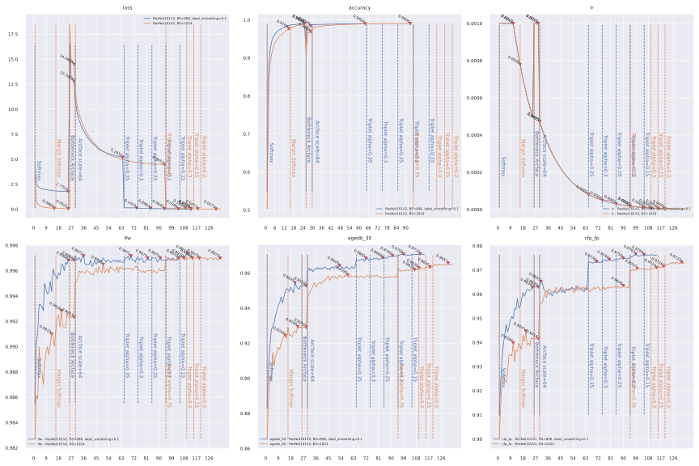
  - **SGDW 5e-5 + Arcface scale=32 E5 -> Arcface scale=64 lr decay** / **AdamW 5e-5 + Softmax + Center**
    ```py
    hist_path = "checkpoints/resnet101/"
    pp = {}
    pp["customs"] = ["cfp_fp", "agedb_30", "lfw", "lr", "center_embedding_loss"]
    pp["epochs"] = [5, 4, 5, 5, 20]
    names = ["Arcface scale=32", "Arcface scale=64, lr 0.1", "Arcface scale=64, lr 0.01", "Arcface scale=64, lr 1e-3", "Arcface scale=64, lr 1e-4"]
    axes, _ = plot.hist_plot_split(hist_path + "TF_resnet101v2_E_sgdw_5e5_dr4_lr1e1_random0_arc32_E5_arc_BS512_emore_hist.json", names=names, **pp)
    pp["axes"] = axes

    pp["epochs"] = [20, 20]
    names = ["Softmax + Center", "Softmax + Center"]
    axes, _ = plot.hist_plot_split(hist_path + "keras_resnet101v2_emore_adamw_5e5_soft_center_1e2D_arc_tripD_hist.json", fig_label="resnet101v2 [center 0.01, E20], [center 0.1, E20]", names=names, **pp)
    axes, _ = plot.hist_plot_split(hist_path + "keras_resnet101_emore_adamw_5e5_soft_center_1e2D_arc_tripD_hist.json", fig_label="resnet101, [center 0.01, E20], [center 0.1, E20]", **pp)
    axes, _ = plot.hist_plot_split(hist_path + "keras_resnet101v2_prelu_emore_adamw_5e5_soft_center_1e2D_arc_tripD_hist.json", fig_label="resnet101v2+PReLU, [center 0.01, E20], [center 0.1, E20]", **pp)
    axes, _ = plot.hist_plot_split(hist_path + "keras_resnet101v2_emore_adamw_5e5_soft_center_1e1D_arc_tripD_hist.json", fig_label="resnet101v2 [center 0.1, E20], [center 1, E20]", **pp)
    axes, _ = plot.hist_plot_split(hist_path + "keras_resnet101v2_emore_adamw_5e5_soft_center_1e2D1_arc_tripD_hist.json", fig_label="[softmax, E20], [center 0.01, E20]", **pp, save="ResNet101V2_center.svg")
    ```
    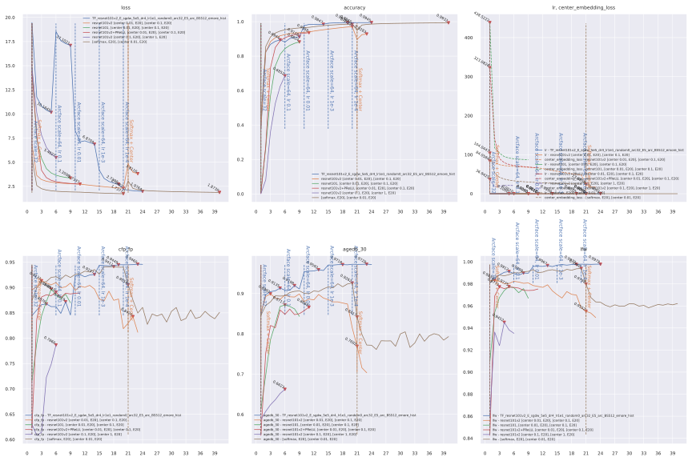
## ResNeSt101
  - **Nadam + softmax E25 -> bottleneckOnly E4 -> Arcface -> Triplet**
    ```py
    hist_path = "checkpoints/resnet101/"
    customs = ["lfw", "agedb_30", "cfp_fp"]
    epochs = [25, 4, 35, 10, 10, 10, 10, 10]
    names = ["Softmax", "Bottleneck Arcface", "Arcface scale=64", "Triplet alpha=0.35", "Triplet alpha=0.3", "Triplet alpha=0.25", "Triplet alpha=0.2", "Triplet alpha=0.15"]
    axes, _ = plot.hist_plot_split([hist_path + 'keras_resnet101_emore_II_hist.json', hist_path + 'keras_resnet101_emore_II_triplet_hist.json'], epochs, customs=customs, names=names, fig_label='Resnet101, BS=896, label_smoothing=0.1')

    hist_path = "checkpoints/resnest101/"
    axes, _ = plot.hist_plot_split([hist_path + 'keras_ResNest101_emore_arcface_60_hist.json', hist_path + 'keras_ResNest101_emore_triplet_hist.json'], epochs, customs=customs, axes=axes, fig_label='ResNeSt101, BS=600', save="ResNest101.svg")
    ```
    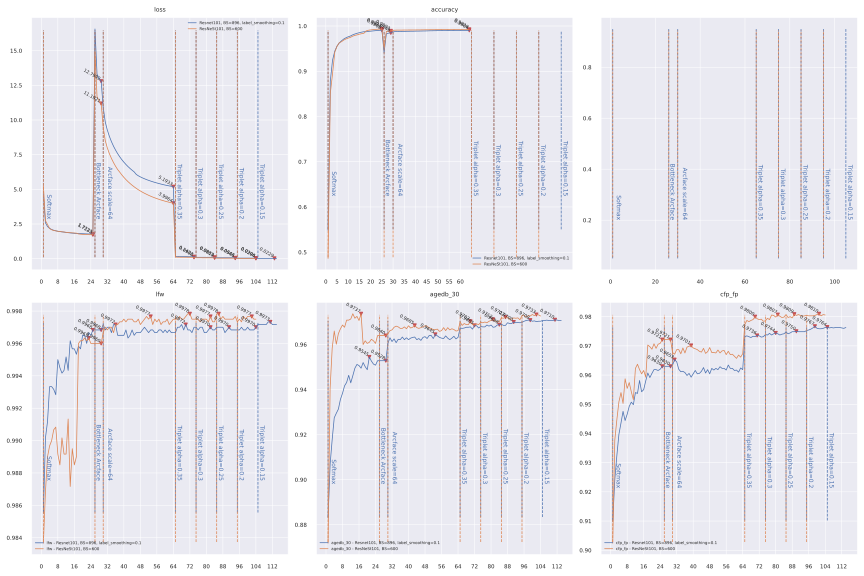
## EfficientNetB4
  - **Nadam + softmax E25 -> bottleneckOnly E4 -> Arcface -> Triplet**
    ```py
    customs = ["lfw", "agedb_30", "cfp_fp"]
    epochs = [15, 10, 4, 30]
    names = ["Softmax", "Margin Softmax", "Bottleneck Arcface", "Arcface scale=64", "Triplet"]
    axes, _ = plot.hist_plot_split("checkpoints/resnet101/keras_resnet101_emore_II_hist.json", epochs, names=names, customs=customs, fig_label='Resnet101, BS=1024, label_smoothing=0.1')
    axes, _ = plot.hist_plot_split("checkpoints/efficientnet/keras_EB4_emore_hist.json", epochs, customs=customs, axes=axes, fig_label='EB4, BS=840, label_smoothing=0.1', save="eb4.svg")
    ```
    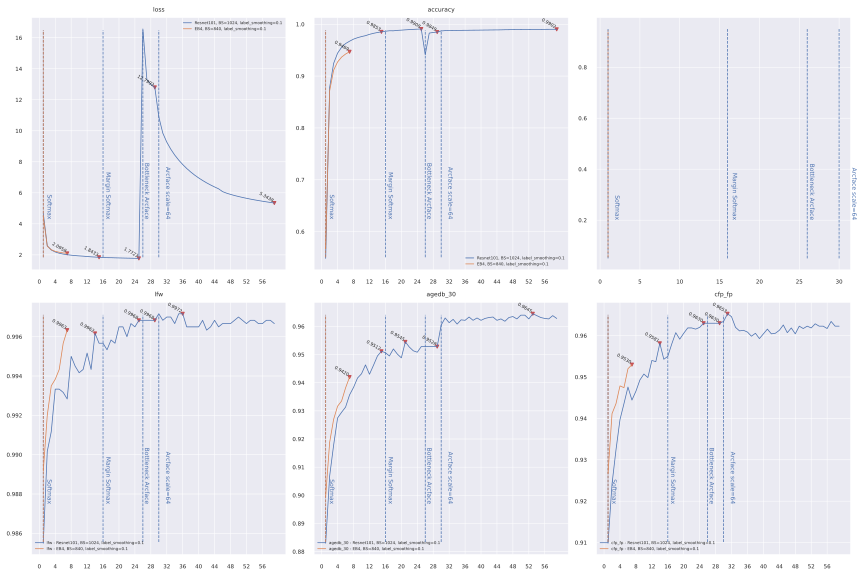
## ResNet34 CASIA
  ```py
  hist_path = "checkpoints/resnet34/"
  pp = {}
  pp["customs"] = ["cfp_fp", "agedb_30", "lfw", "lr", "regular_loss"]
  pp["epochs"] = [1, 19, 10, 50]
  names = ["Warmup", "Arcfacelose learning rate 0.1", "Arcfacelose learning rate 0.01", "Arcfacelose learning rate 0.001"]
  axes, pre = plot.hist_plot_split(hist_path + "mxnet_r34_wdm1_new.json", fig_label="Original MXNet", names=names, **pp)
  pp["axes"] = axes
  # axes, pre = plot.hist_plot_split("checkpoints/MXNET_r34_casia.json", epochs, axes=axes, customs=customs)

  axes, pre = plot.hist_plot_split(hist_path + "NNNN_resnet34_MXNET_E_baseline_SGD_lr1e1_random0_arcT4_32_E5_BS512_casia_hist.json", fig_label="TF SGD baseline", **pp)
  axes, pre = plot.hist_plot_split(hist_path + "NNNN_resnet34_MXNET_E_sgdw_5e4_dr4_lr1e1_wdm1_random0_arcT4_32_E5_BS512_casia_hist.json", fig_label="TF SGDW 5e-4", **pp)
  axes, pre = plot.hist_plot_split(hist_path + "NNNN_resnet34_MXNET_E_SGDW_1e3_lr1e1_random0_arc_S32_E1_BS512_casia_4_hist.json", fig_label="TF SGDW 1e-3", **pp)

  axes, pre = plot.hist_plot_split(hist_path + "NNNN_resnet34_MXNET_E_REG_BN_SGD_5e4_lr1e1_random0_arcT4_S32_E1_BS512_casia_3_hist_no_reg.json", fig_label="TF SGD, l2 5e-4", **pp)
  # axes, pre = plot.hist_plot_split(hist_path + "NNNN_resnet34_MXNET_E_SGD_REG_1e3_clone_lr1e1_random0_arc_S32_E1_BS512_casia_4_hist.json", fig_label="TF SGD, l2 1e-3", **pp, save="resnet34_casia.svg")
  axes, pre = plot.hist_plot_split(hist_path + "resnet34_MXNET_E_SGD_REG_1e3_lr1e1_random0_arc_S32_E1_BS512_casia_hist.json", fig_label="TF SGD, l2 1e-3", **pp, save="resnet34_casia.svg")

  choose_accuracy([
      hist_path + "mxnet_r34_wdm1_new.json",
      hist_path + "NNNN_resnet34_MXNET_E_baseline_SGD_lr1e1_random0_arcT4_32_E5_BS512_casia_hist.json",
      hist_path + "NNNN_resnet34_MXNET_E_sgdw_5e4_dr4_lr1e1_wdm1_random0_arcT4_32_E5_BS512_casia_hist.json",
      hist_path + "NNNN_resnet34_MXNET_E_SGDW_1e3_lr1e1_random0_arc_S32_E1_BS512_casia_4_hist.json",
      hist_path + "NNNN_resnet34_MXNET_E_REG_BN_SGD_5e4_lr1e1_random0_arcT4_S32_E1_BS512_casia_3_hist_no_reg.json",
      hist_path + "NNNN_resnet34_MXNET_E_SGD_REG_1e3_clone_lr1e1_random0_arc_S32_E1_BS512_casia_4_hist.json",
      hist_path + "resnet34_MXNET_E_SGD_REG_1e3_lr1e1_random0_arc_S32_E1_BS512_casia_hist.json",
  ])
  ```
  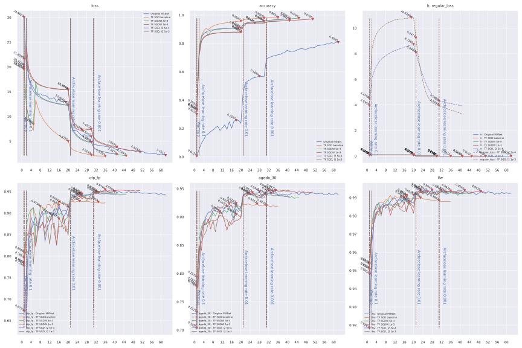

  | Backbone    | Optimizer | wd   | l2_reg | lfw,cfp_fp,agedb_30,epoch       |
  | ----------- | --------- | ---- | ------ | ------------------------------- |
  | MXNet r34   | SGD       | 5e-4 | None   | 0.9933, 0.9514, 0.9448, E31     |
  | TF resnet34 | SGD       | None | None   | 0.9897, 0.9269, 0.9228, E20     |
  | TF resnet34 | SGDW      | 5e-4 | None   | 0.9927, 0.9476, 0.9388, E32     |
  | TF resnet34 | SGDW      | 1e-3 | None   | 0.9935, **0.9549**, 0.9458, E35 |
  | TF resnet34 | SGD       | None | 5e-4   | **0.9940**, 0.9466, 0.9415, E31 |
  | TF resnet34 | SGD       | None | 1e-3   | 0.9937, 0.9491, **0.9463**, E31 |
## MXNet record
  ```sh
  $ CUDA_VISIBLE_DEVICES="1" python -u train_softmax.py --data-dir /datasets/faces_casia --network "r34" --loss-type 4 --prefix "./model/mxnet_r34_wdm1_casia" --per-batch-size 512 --lr-steps "19180,28770" --margin-s 64.0 --margin-m 0.5 --ckpt 1 --emb-size 512 --fc7-wd-mult 1.0 --wd 0.0005 --verbose 959 --end-epoch 38400 --ce-loss

  Called with argument: Namespace(batch_size=512, beta=1000.0, beta_freeze=0, beta_min=5.0, bn_mom=0.9, ce_loss=True, ckpt=1, color=0, ctx_num=1, cutoff=0, data_dir='/datasets/faces_casia', easy_margin=0, emb_size=512, end_epoch=38400, fc7_lr_mult=1.0, fc7_no_bias=False, fc7_wd_mult=1.0, gamma=0.12, image_channel=3, image_h=112, image_size='112,112', image_w=112, images_filter=0, loss_type=4, lr=0.1, lr_steps='19180,28770', margin=4, margin_a=1.0, margin_b=0.0, margin_m=0.5, margin_s=64.0, max_steps=0, mom=0.9, network='r34', num_classes=10572, num_layers=34, per_batch_size=512, power=1.0, prefix='./model/mxnet_r34_wdm1_casia', pretrained='', rand_mirror=1, rescale_threshold=0, scale=0.9993, target='lfw,cfp_fp,agedb_30', use_deformable=0, verbose=959, version_act='prelu', version_input=1, version_multiplier=1.0, version_output='E', version_se=0, version_unit=3, wd=0.0005)
  ```
  ```py
  Called with argument: Namespace(batch_size=512, beta=1000.0, beta_freeze=0, beta_min=5.0, bn_mom=0.9, ce_loss=True,
  ckpt=1, color=0, ctx_num=1, cutoff=0, data_dir='/datasets/faces_casia', easy_margin=0, emb_size=512, end_epoch=38400,
  fc7_lr_mult=1.0, fc7_no_bias=False, fc7_wd_mult=1.0, gamma=0.12, image_channel=3, image_h=112, image_size='112,112',
  image_w=112, images_filter=0, loss_type=4, lr=0.1, lr_steps='19180,28770', margin=4, margin_a=1.0, margin_b=0.0,
  margin_m=0.5, margin_s=64.0, max_steps=0, mom=0.9, network='r34', num_classes=10572, num_layers=34, per_batch_size=512,
  power=1.0, prefix='./model/mxnet_r34_wdm1_lazy_false_casia', pretrained='', rand_mirror=1, rescale_threshold=0, scale=0.9993,
  target='lfw,cfp_fp,agedb_30', use_deformable=0, verbose=959, version_act='prelu', version_input=1, version_multiplier=1.0,
  version_output='E', version_se=0, version_unit=3, wd=0.0005)
  ```
  ```py
  from train_softmax import *
  sys.argv.extend('--data-dir /datasets/faces_casia --network "r34" --loss-type 4 --prefix "./model/mxnet_r34_wdm1_lazy_false_wd0_casia" --per-batch-size 512 --lr-steps "19180,28770" --margin-s 64.0 --margin-m 0.5 --ckpt 1 --emb-size 512 --fc7-wd-mult 1.0 --wd 5e-4 --verbose 959 --end-epoch 38400 --ce-loss'.replace('"', '').split(' '))
  args = parse_args()
  ```
  ```py
  CUDA_VISIBLE_DEVICES='0' python train.py --network r34 --dataset casia --loss 'arcface' --per-batch-size 512 --lr-steps '19180,28770' --verbose 959
  ```
  ```sh
  # Sub-center
  CUDA_VISIBLE_DEVICES='1' python train_parall.py --network r50 --per-batch-size 512
  INFO:root:Iter[20] Batch [8540] Speed: 301.72 samples/sec
  {fc7_acc} 236000 0.80078125
  CELOSS,236000,1.311261
  [lfw][236000]Accuracy-Flip: 0.99817+-0.00273
  [cfp_fp][236000]Accuracy-Flip: 0.97557+-0.00525
  [agedb_30][236000]Accuracy-Flip: 0.98167+-0.00707

  CUDA_VISIBLE_DEVICES='1' python drop.py --data /datasets/faces_emore --model models/r50-arcface-emore/model,1 --threshold 75 --k 3 --output /datasets/faces_emore_topk3_1
  ```
***

# Mobilenet on Emore
## Mobilenet batch size 256 on Emore
  ```py
  hist_path = "checkpoints/mobilenet_emore_tests/"
  pp = {}
  pp["customs"] = ["cfp_fp", "agedb_30", "lfw", "lr", "center_embedding_loss", "triplet_embedding_loss"]
  pp["epochs"] = [10, 10, 10, 10, 10, 10, 10, 10]
  names = ["Softmax + Center = %d" % ii for ii in [1, 10, 20, 30, 40, 50, 60, 70]]
  axes, pre = plot.hist_plot_split(hist_path + "mobilenet_adamw_BS256_E80_hist.json", fig_label='exp, mobilenet, [soft ls=0.1 + center, adamw 5e-5, dr 0, E10]', names=names, **pp)
  pp["axes"] = axes
  pp.update({"pre_item": pre, "init_epoch": 80})

  pp["epochs"] = [2, 10, 10, 10, 10, 50]
  names = ["Arcloss Bottleneck Only"] + ["Arcface scale 64 + Triplet 64 alpha %.2f" % ii for ii in [0.35, 0.3, 0.25, 0.2, 0.15]]
  axes, _ = plot.hist_plot_split(hist_path + "mobilenet_adamw_BS256_E80_arc_c64_hist.json", fig_label='exp, mobilenet, [soft, E80] [arc, E40]', names=names, **pp)
  axes, _ = plot.hist_plot_split(hist_path + "mobilenet_adamw_BS256_E80_arc_trip_hist.json", fig_label='exp,mobilenet,[soft, E80] [arc+trip 32,E20] [arc+trip 64,alpha0.3,E40]', **pp)
  axes, _ = plot.hist_plot_split(hist_path + "mobilenet_adamw_BS256_E80_arc_trip128_hist.json", fig_label='exp,mobilenet,[soft, E80] [arc+trip 128,alpha0.3,E40]', **pp)

  axes, _ = plot.hist_plot_split(hist_path + "mobilenet_adamw_BS256_E80_arc_trip64_hist.json", fig_label='exp,mobilenet,[soft, E80] [arc+trip 64,alpha0.3,E40]', **pp)
  axes, _ = plot.hist_plot_split(hist_path + "mobilenet_adamw_BS256_E80_arc_tripD_hist.json", fig_label='exp,mobilenet,[soft, E80] [arc+trip 64,alpha decay,E40]', **pp, save="mobilenet_emore_bs256.svg")
  ```
  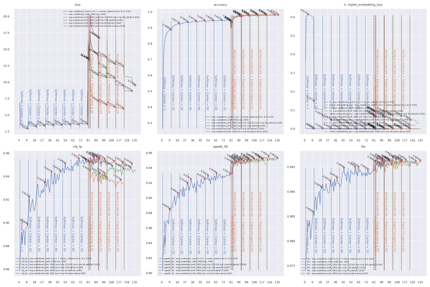
## Mobilenet batch size 1024 on Emore
  ```py
  T_keras_mobilenet_basic_adamw_2_emore_hist [S+C1, adamw 1e-5, E24]
      --> T_keras_mobilenet_basic_adamw_E25_arcloss_emore_hist [B, E2] -> [arc, adamw 5e-5, E35]

  T_keras_mobilenet_basic_adamw_2_emore_hist --> T_keras_mobilenet_basic_adamw_2_emore_hist_E70 [S+C1, adamw 1e-5, E25] -> [S+C10, adamw 5e-5,E25] [S+C32,E20]
    --> T_keras_mobilenet_basic_adamw_2_E70_arc_emore_hist [B, E2] -> [Arcface scale=64, E35] # 86_cuda_0.ipynb
    --> T_keras_mobilenet_basic_adamw_2_emore_hist_E105 [S+C64, E35]
      --> T_keras_mobilenet_basic_adamw_2_emore_hist [T10, A0.3, E5]
      --> T_keras_mobilenet_basic_adamw_2_E105_trip20_0.3_hist [C64, T20, A0.3, E5] # 86_cuda_1.ipynb
      --> T_keras_mobilenet_basic_adamw_2_E105_trip32_0.3_hist [C64, T32, A0.3, E25] # 86_cuda_1.ipynb
      --> T_keras_mobilenet_basic_adamw_2_E105_trip64_0.2_hist [C64, T32, A0.2, E5] # 86_cuda_1.ipynb

  # 86_cuda_0.ipynb
  T_mobilenet_adamw_5e5_BS1024_hist [S+C[1,32,64], E20x3]
    --> T_mobilenet_adamw_5e5_arc_trip64_BS1024_hist [B, E2] -> [T64, A[0.35->0.2], E20x4]
    --> T_mobilenet_adamw_5e5_arc_trip32_BS1024_hist [B, E2] -> [T32, A[0.35->0.2], E20x4]
  ```
  ```py
  hist_path = "checkpoints/mobilenet_emore_tests/"
  pp = {}
  pp["customs"] = ["cfp_fp", "agedb_30", "lfw", "lr", "center_embedding_loss", "triplet_embedding_loss"]
  pp["epochs"] = [25, 25, 20, 35, 5]
  names = ["Softmax + Center = %d" % ii for ii in [1, 10, 32, 64]] + ["Triplet 10, alpha 0.3"]
  axes, _ = plot.hist_plot_split(hist_path + "T_keras_mobilenet_basic_adamw_2_emore_hist.json", fig_label='exp, [soft,adamw 1e-5,E25] [C->10,A->5e-5,E25] [C->32,E20] [C->64,E35] [triplet 10,a0.3,E5]', names=names, **pp)
  pp["axes"] = axes

  pp["epochs"] = [4, 35]
  names = ["Bottleneck Arcface", "Arcface scale=64"]
  pre_item = {kk: vv[24] for kk, vv in json.load(open(hist_path + "T_keras_mobilenet_basic_adamw_2_emore_hist.json", 'r')).items() if len(vv) > 25}
  pre = {"pre_item": pre_item, "init_epoch": 25}
  axes, _ = plot.hist_plot_split(hist_path + "T_keras_mobilenet_basic_adamw_E25_arcloss_emore_hist.json", fig_label=' exp, [soft ls=0.1 + center, adamw 1e-5, E25] [arc, adamw 5e-5, E35]', names=names, **pre, **pp)

  pp["epochs"] = [2, 35]
  names = ["Bottleneck Arcface", "Arcface scale=64"]
  pre_item = {kk: vv[69] for kk, vv in json.load(open(hist_path + "T_keras_mobilenet_basic_adamw_2_emore_hist.json", 'r')).items() if len(vv) > 70}
  pre = {"pre_item": pre_item, "init_epoch": 70}
  axes, _ = plot.hist_plot_split(hist_path + "T_keras_mobilenet_basic_adamw_2_E70_arc_emore_hist.json", fig_label='exp,mobilenet, [soft ls=0.1 + center, adamw 5e-5, E70] [arc, E35]', names=names, **pre, **pp)

  pp["epochs"] = [25]
  names = ["Triplet"]
  pre_item = {kk: vv[104] for kk, vv in json.load(open(hist_path + "T_keras_mobilenet_basic_adamw_2_emore_hist.json", 'r')).items() if len(vv) > 105}
  pre = {"pre_item": pre_item, "init_epoch": 105}
  axes, _ = plot.hist_plot_split(hist_path + "T_keras_mobilenet_basic_adamw_2_E105_trip32_0.3_hist.json", fig_label='exp, [soft ls=0.1 + center, adamw 5e-5, E105] [triplet 32,a0.3,E25]', names=names, **pre, **pp)
  axes, _ = plot.hist_plot_split(hist_path + "T_keras_mobilenet_basic_adamw_2_E105_trip20_0.3_hist.json", fig_label='exp, [soft,adamw 5e-5, E105] [triplet 20,a0.3,E5]', **pre, **pp)
  axes, _ = plot.hist_plot_split(hist_path + "T_keras_mobilenet_basic_adamw_2_E105_trip64_0.2_hist.json", fig_label='exp, [soft ls=0.1 + center, adamw 5e-5, E105] [triplet 64,a0.2,E5]', **pre, **pp)

  pp["epochs"] = [20, 20, 20, 2, 20, 20, 20, 20]
  names = ["Softmax + Center = %d" % ii for ii in [1, 32, 64]] + ["Bottleneck Arcface"] + ["Arcface scale 64 + Triplet 64 alpha %.2f" % ii for ii in [0.35, 0.3, 0.25, 0.2]]
  axes, _ = plot.hist_plot_split([hist_path + "T_mobilenet_adamw_5e5_BS1024_hist.json", hist_path + "T_mobilenet_adamw_5e5_arc_trip64_BS1024_hist.json"], fig_label='exp,mobilenet,BS1024,[soft,adamw 5e-5,dr 0 E60] [arc+trip 64,alpha decay,E40]', names=names, **pp)
  pp["epochs"] = [20, 20, 20, 2, 10, 10, 10, 10]
  names = [""] * 5 + ["Arcface scale 64 + Triplet 32 alpha %.2f" % ii for ii in [0.3, 0.25, 0.2]]
  axes, _ = plot.hist_plot_split([hist_path + "T_mobilenet_adamw_5e5_BS1024_hist.json", hist_path + "T_mobilenet_adamw_5e5_arc_trip32_BS1024_hist.json"], fig_label='exp,mobilenet,BS1024,[soft,adamw 5e-5,dr 0 E60] [arc+trip 32,alpha decay,E40]', names=names, **pp)

  # Plot the best of batch_size=256
  pp["epochs"] = [10, 10, 10, 10, 10, 10, 10, 10, 2, 10, 10, 10, 10, 50]
  names = ["Softmax + Center = %d" % ii for ii in [1, 10, 20, 30, 40, 50, 60, 70]] + ["Arcloss Bottleneck Only"] + ["Arcloss + Triplet 64 alpha %.2f" % ii for ii in [0.35, 0.3, 0.25, 0.2, 0.15]]
  axes, _ = plot.hist_plot_split([hist_path + "mobilenet_adamw_BS256_E80_hist.json", hist_path + "mobilenet_adamw_BS256_E80_arc_tripD_hist.json"], fig_label='exp,mobilenet,BS256,[soft,adamw 5e-5,dr 0 E80] [arc+trip 64,alpha decay,E40]', names=names, **pp, save="mobilenet_emore_bs1024.svg")
  ```
  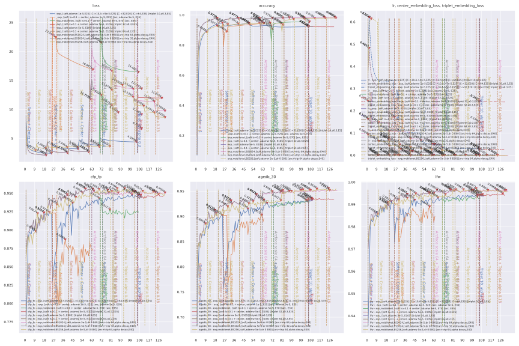
## Mobilenet batch size 1024 on Emore testing cosine learning rate
  ```py
  hist_path = "checkpoints/mobilenet_emore_tests/"
  pp = {}
  pp["customs"] = ["cfp_fp", "agedb_30", "lfw", "lr", "center_embedding_loss", "triplet_embedding_loss", "arcface_loss"]
  pp["epochs"] = [25, 4, 35]
  names = ["Softmax", "Bottleneck Arcface", "Arcface scale=64"]
  axes, _ = plot.hist_plot_split(hist_path + "T_keras_mobilenet_basic_n_center_cos_emore_hist.json", fig_label='exp, [soft + center, adam, E25] [arc + center, E35]', names=names, **pp)
  pp["axes"] = axes

  axes, _ = plot.hist_plot_split(hist_path + "T_keras_mobilenet_basic_emore_hist.json", fig_label='exp, [soft, nadam, E25] [arc, nadam, E35]', **pp)
  axes, _ = plot.hist_plot_split(hist_path + "T_keras_mobilenet_basic_n_emore_hist.json", fig_label='exp, [soft, adam, E25] [arc, E35]', **pp)
  axes, _ = plot.hist_plot_split(hist_path + "T_keras_mobilenet_cos_emore_hist.json", fig_label='cos, restarts=5, [soft, nadam, E25] [arc, nadam, E35]', **pp)
  axes, _ = plot.hist_plot_split(hist_path + "T_keras_mobilenet_cos_4_emore_hist.json", fig_label='cos, restarts=4, [soft, adam, E25] [arc, E35]', **pp, save="mobilenet_emore_bs1024_cos.svg")
  ```
  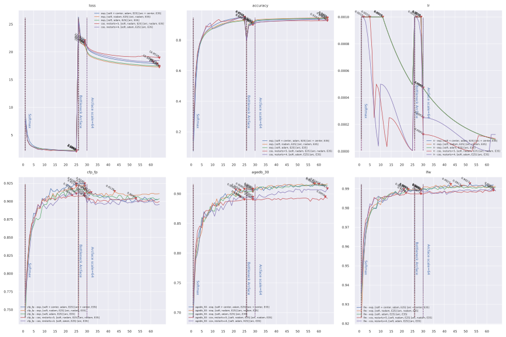
## Mobilenet batch size 1024 on Emore testing soft center triplet combination
  ```py
  hist_path = "checkpoints/mobilenet_emore_tests/"
  pp = {}
  pp["customs"] = ["cfp_fp", "agedb_30", "lfw", "lr", "center_embedding_loss", "triplet_embedding_loss", "arcface_loss"]
  pp["epochs"] = [25, 4, 35]
  names = ["Softmax", "Bottleneck Arcface", "Arcface scale=64"]
  axes, _ = plot.hist_plot_split(hist_path + "T_keras_mobilenet_basic_n_center_cos_emore_hist.json", fig_label='exp, [soft + center, adam, E25] [arc + center, E35]', names=names, **pp)
  pp["axes"] = axes

  pp["epochs"] = [60, 4, 40, 20]
  names=["", "Bottleneck Arcface", "Arcface scale=64", "Triplet"]
  axes, _ = plot.hist_plot_split(hist_path + "T_keras_mobilenet_basic_n_center_emore_hist.json", fig_label='exp, [soft + center, adam, E60] [arc + center, E35]', names=names, **pp)
  axes, _ = plot.hist_plot_split(hist_path + "T_keras_mobilenet_basic_n_center_ls_emore_hist.json", fig_label='exp, [soft + center, adam, E60] [arc ls=0.1 + center 64, E35]', **pp)

  axes, _ = plot.hist_plot_split(hist_path + "T_keras_mobilenet_basic_n_center_triplet_emore_hist.json", fig_label='exp, [soft + center, adam, E60] [soft + triplet, E12]', **pp)
  axes, _ = plot.hist_plot_split(hist_path + "T_keras_mobilenet_basic_n_center_triplet_ls_emore_hist.json", fig_label='exp, [soft + center, adam, E60] [soft ls=0.1 + triplet, E12]', **pp)
  axes, _ = plot.hist_plot_split(hist_path + "T_keras_mobilenet_basic_n_center_triplet_center_emore_hist.json", fig_label='exp, [soft + center, adam, E60] [soft + triplet + center, E30]', **pp)
  axes, _ = plot.hist_plot_split(hist_path + "T_keras_mobilenet_basic_n_center_triplet_center_ls_emore_hist.json", fig_label='exp, [soft + center, adam, E60] [soft ls=0.1 + triplet + center, E30]', **pp)

  # Plot the best of batch_size=1024
  pp["epochs"] = [20, 20, 20, 2, 10, 10, 10, 10]
  names = ["Softmax + Center = %d" % ii for ii in [1, 32, 64]] + ["Bottleneck Arcface"] + ["Arcface scale 64 + Triplet 64 alpha %.2f" % ii for ii in [0.35, 0.3, 0.25, 0.2]]
  axes, _ = plot.hist_plot_split([hist_path + "T_mobilenet_adamw_5e5_BS1024_hist.json", hist_path + "T_mobilenet_adamw_5e5_arc_trip32_BS1024_hist.json"], fig_label='exp,mobilenet,BS1024,[soft,adamw 5e-5,dr 0 E60] [arc+trip 32,alpha decay,E40]', names=names, **pp, save="mobilenet_emore_bs1024_triplet.svg")
  ```
  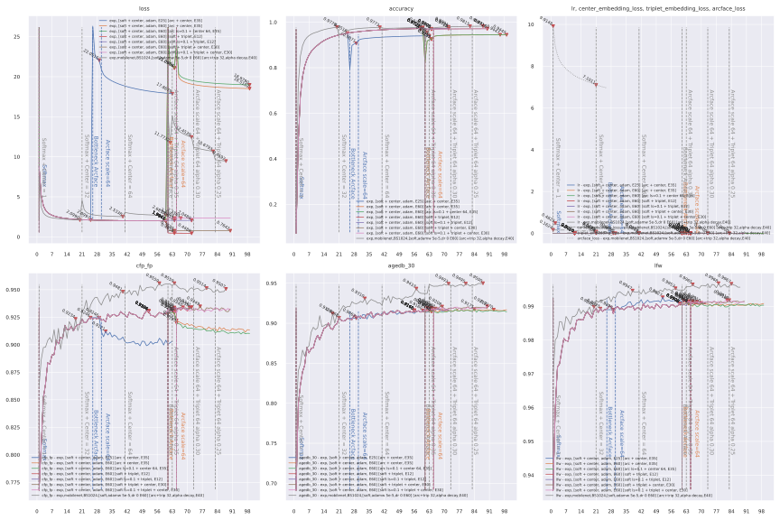
## Mobilenet testing centerloss
  ```py
  import losses, train, models
  import tensorflow_addons as tfa

  data_path = '/datasets/faces_emore_112x112_folders'
  eval_paths = ['/datasets/faces_emore/lfw.bin', '/datasets/faces_emore/cfp_fp.bin', '/datasets/faces_emore/agedb_30.bin']

  basic_model = models.buildin_models("mobilenet", dropout=0, emb_shape=256, output_layer='GDC')
  tt = train.Train(data_path, save_path='keras_mobilenet_emore_adamw_5e5_soft_centerD_type_norm_arc_tripD.h5', eval_paths=eval_paths,
      basic_model=basic_model, lr_base=0.001, batch_size=256, random_status=3)
  optimizer = tfa.optimizers.AdamW(learning_rate=0.001, weight_decay=5e-5)
  sch = [{"loss": keras.losses.CategoricalCrossentropy(label_smoothing=0.1), "centerloss": ii, "centerlossType": losses.CenterLossNorm, "epoch": 10} for ii in [1, 10, 20, 30, 40, 50, 60, 70]]
  sch[0]["optimizer"] = optimizer

  tt.train(sch, 0)
  ```
  ```py
  import json
  pp = {}
  # pp["customs"] = ["cfp_fp", "agedb_30", "lfw", "center_embedding_loss", "triplet_embedding_loss", "lr"]
  pp["customs"] = ["cfp_fp", "agedb_30", "lfw", "triplet_embedding_loss", "lr", "arcface_loss", "regular_loss"]
  # pp["customs"] = plot.EVALS_NAME + [ii+"_thresh" for ii in plot.EVALS_NAME]
  # pp["customs"] = plot.EVALS_NAME + ['lr']
  pp["epochs"] = [10] * 8
  # pp["epochs"] = [10] * 8 + [2] + [10] * 1
  names = ["Softmax + Center = %d" % ii for ii in [1, 10, 20, 30, 40, 50, 60, 70]] + ["Arcloss Bottleneck Only"] + ["Arcloss + Triplet 64 alpha %.2f" % ii for ii in [0.35, 0.3, 0.25, 0.2, 0.15]]
  axes, _ = plot.hist_plot_split("checkpoints/keras_mobilenet_emore_adamw_5e5_soft_baseline_hist.json", names=names, **pp)
  pp["axes"] = axes

  axes, _ = plot.hist_plot_split("checkpoints/keras_mobilenet_PRELU_emore_adamw_5e5_soft_hist.json", names=names, **pp)
  axes, _ = plot.hist_plot_split("checkpoints/keras_mobilenet_pointwise_E_emore_adamw_5e5_soft_hist.json", names=names, **pp)
  axes, _ = plot.hist_plot_split("checkpoints/keras_mobilenet_pointwise_emore_adamw_5e5_soft_hist.json", names=names, **pp)
  axes, _ = plot.hist_plot_split("checkpoints/keras_mobilenet_prelu_emore_adamw_5e5_soft_new_center_1e2D_arc_tripD_hist.json", names=names, **pp)
  axes, _ = plot.hist_plot_split("checkpoints/keras_mobilenet_emore_adamw_5e5_soft_centerD_type_sum_arc_tripD_hist.json", names=names, **pp)
  ```
  ```py
  # Plot the previous best of batch_size=256
  import json
  pp = {}
  # pp["customs"] = ["cfp_fp", "agedb_30", "lfw", "center_embedding_loss", "triplet_embedding_loss", "lr"]
  pp["customs"] = ["cfp_fp", "agedb_30", "lfw", "triplet_embedding_loss", "lr", "arcface_loss", "regular_loss"]
  # pp["customs"] = plot.EVALS_NAME + [ii+"_thresh" for ii in plot.EVALS_NAME]
  # pp["customs"] = plot.EVALS_NAME + ['lr']
  pp["epochs"] = [10] * 8 + [2] + [10] * 4 + [50]
  # pp["epochs"] = [10] * 8 + [2] + [10] * 1
  pp["names"] = ["Softmax + Center = %d" % ii for ii in [1, 10, 20, 30, 40, 50, 60, 70]] + ["Arcloss Bottleneck Only"] + ["Arcloss + Triplet 64 alpha %.2f" % ii for ii in [0.35, 0.3, 0.25, 0.2, 0.15]]
  axes, _ = plot.hist_plot_split(["checkpoints/mobilenet_emore_tests/mobilenet_adamw_BS256_E80_hist.json", "checkpoints/mobilenet_emore_tests/mobilenet_adamw_BS256_E80_arc_tripD_hist.json"], **pp)
  pp["axes"] = axes

  pp["epochs"] = [15, 30] + [10] * 4
  pp["names"] = ["", "Arcloss"] + ["Arcloss + Triplet 64 alpha %.2f" % ii for ii in [0.35, 0.3, 0.25, 0.2]]
  axes, _ = plot.hist_plot_split("checkpoints/keras_mobilenet_emore_nadam_soft_arc_tripD_hist.json", **pp)
  pp["names"] = None

  pp["epochs"] = [10] * 8 + [10] * 4 + [50]
  axes, _ = plot.hist_plot_split("checkpoints/keras_mobilenet_emore_adamw_5e5_soft_baseline_hist.json", **pp)
  pre_item = {kk: vv[79] for kk, vv in json.load(open("checkpoints/keras_mobilenet_emore_adamw_5e5_soft_baseline_hist.json", 'r')).items() if len(vv) > 80}
  axes, _ = plot.hist_plot_split("checkpoints/keras_mobilenet_emore_adamw_5e5_soft_baseline_before_arc_E80_BTO_E2_arc_hist.json", pre_item=pre_item, init_epoch=80, **pp)

  # axes, _ = plot.hist_plot_split("checkpoints/keras_mobilenet_emore_adamw_5e5_soft_activity_regularizer_l21e3_hist.json", **pp)
  # axes, _ = plot.hist_plot_split("checkpoints/keras_mobilenet_emore_adamw_5e5_soft_activity_regularizer_l25e1_hist.json", **pp)
  axes, _ = plot.hist_plot_split("checkpoints/keras_mobilenet_emore_adamw_5e5_soft_activity_regularizer_l21e2_hist.json", **pp)

  # axes, _ = plot.hist_plot_split("checkpoints/keras_mobilenet_emore_adamw_5e5_soft_centerD_arc_tripD_hist.json", fig_label="SUM/2, diff/count, C0.01, 0.1->0.7, E10x8", **pp)
  # axes, _ = plot.hist_plot_split("checkpoints/keras_mobilenet_prelu_emore_adamw_5e5_soft_new_center_1e2D_arc_tripD_hist.json", fig_label="PReLU, SUM/2, diff/count, C0.01, 0.1, 1, 10, E20x4", **pp)

  # axes, _ = plot.hist_plot_split("checkpoints/keras_mobilenet_emore_adamw_5e5_soft_centerD_type_norm_arc_tripD_hist.json", fig_label="Norm, C1, 10->70, E10x8", **pp)
  # axes, _ = plot.hist_plot_split("checkpoints/keras_mobilenet_emore_adamw_5e5_soft_centerD_type_cosine_arc_tripD_hist.json", fig_label="Cosine, C1, 10->70, E10x8", **pp)
  axes, _ = plot.hist_plot_split("checkpoints/keras_mobilenet_emore_adamw_5e5_soft_centerD_type_mean_arc_tripD_hist.json", fig_label="Mean, C1, 10->70, E10x8", **pp)

  pp["names"] = [""] * 8 + ["Arcloss + Triplet 64 alpha %.2f" % ii for ii in [0.35, 0.3, 0.25, 0.2]]
  if "center_embedding_loss" in pp["customs"]: pp["customs"].pop(pp["customs"].index('center_embedding_loss'))
  axes, _ = plot.hist_plot_split("checkpoints/keras_mobilenet_emore_adamw_5e5_soft_centerD_type_sum_arc_tripD_hist.json", fig_label="SUM/2, diff/(count+1), C0.01, 0.1->0.7, E10x8", **pp)

  pre_item = {kk: vv[79] for kk, vv in json.load(open("checkpoints/keras_mobilenet_emore_adamw_5e5_soft_centerD_type_sum_arc_tripD_hist.json", 'r')).items() if len(vv) > 80}
  axes, _ = plot.hist_plot_split("checkpoints/keras_mobilenet_emore_adamw_5e5_soft_centerD_type_sum_E80_BTO_E2_arc_hist.json", pre_item=pre_item, init_epoch=80, **pp)
  axes, _ = plot.hist_plot_split("checkpoints/keras_mobilenet_emore_adamw_5e5_soft_centerD_type_sum_E80_arc_MSEtripD_hist.json", pre_item=pre_item, init_epoch=80, **pp)

  pre_item = {kk: vv[79] for kk, vv in json.load(open("checkpoints/keras_mobilenet_emore_adamw_5e5_soft_baseline_hist.json", 'r')).items() if len(vv) > 80}
  axes, _ = plot.hist_plot_split("checkpoints/keras_mobilenet_emore_adamw_5e5_soft_baseline_before_arc_E80_arc_MSEtripD_hist.json", pre_item=pre_item, init_epoch=80, **pp)
  pre_item = {kk: vv[1] for kk, vv in json.load(open("checkpoints/keras_mobilenet_emore_adamw_5e5_soft_baseline_before_arc_E80_BTO_E2_arc_hist.json", 'r')).items()}
  axes, _ = plot.hist_plot_split("checkpoints/keras_mobilenet_emore_adamw_5e5_soft_baseline_before_arc_E80_BTO_E2_arc_MSEtripD_hist.json", pre_item=pre_item, init_epoch=82, **pp)

  # axes, _ = plot.hist_plot_split("checkpoints/keras_resnet101v2_emore_adamw_5e5_soft_center_1e2D1_arc_tripD_hist.json", fig_label="resnet101v2, SUM/2, diff/count, C0, 0.01, 0.1, 1, E20x4", **pp)
  # axes, _ = plot.hist_plot_split("checkpoints/keras_mobilenetv2_emore_adamw_5e5_soft_center_1e2D_arc_tripD_hist.json", fig_label="mobilenetv2, SUM/2, diff/count, C0.01, 0.1, 1, 10, E20x4", **pp)
  ```
## Mobilenet testing SGDW
  ```py
  hist_path = "checkpoints/mobilenet_emore_tests/"
  pp = {}
  pp["epochs"] = [5, 5, 10, 10, 40]
  pp["customs"] = ["cfp_fp", "agedb_30", "lfw", "lr", "triplet_embedding_loss"]
  names = ["ArcFace Scale %d, learning rate %g" %(ss, lr) for ss, lr in zip([16, 32, 64, 64, 64], [0.1, 0.1, 0.1, 0.01, 0.001])]
  axes, pre = plot.hist_plot_split(hist_path + "TT_mobilenet_mobilenet_T4_GDC_bs400_hist.json", fig_label="emb 256, GDC, emore, SGDW 5e-4, momentum 0.9, wdm 1, random 0, bs 400", names=names, **pp)
  pp["axes"] = axes

  pp["epochs"] = [2, 10, 10, 40]
  axes, pre = plot.hist_plot_split(hist_path + "TT_mobilenet_mobilenet_T4_GDC_arc_trip_bs400_hist.json", init_epoch=8, fig_label="[Arc16 E5, Arc32 E5, Arc64+trip64 alpha 0.35 E20, Arc64+trip64 alpha 0.25 E20]", **pp, save="mobilenet_emore_bs400_sgdw.svg")
  ```
  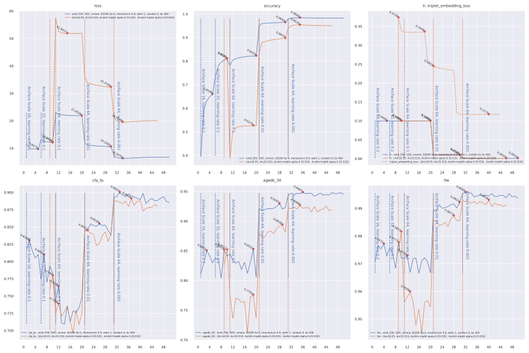
## Mobilefacenet
  ```py
  hist_path = "checkpoints/mobilefacenet/"
  pp = {}
  pp["customs"] = ["cfp_fp", "agedb_30", "lfw", "lr", "triplet_embedding_loss", "center_embedding_loss"]
  pp["epochs"] = [15, 10, 4, 35]
  names = ["Softmax", "Margin Softmax", "Bottleneck Arcface", "Arcface scale=64"]
  axes, _ = plot.hist_plot_split(hist_path + "keras_mobile_facenet_emore_hist.json", fig_label="Mobilefacenet, BS=768, lr_decay0.05", names=names, **pp)
  pp["axes"] = axes

  axes, _ = plot.hist_plot_split(hist_path + "keras_mobilefacenet_256_hist_all.json", fig_label="Mobilefacenet, BS=160, lr_decay0.1", **pp)

  pp["epochs"] = [10]
  pre_item = {kk: vv[43] for kk, vv in json.load(open(hist_path + "keras_mobilefacenet_256_hist_all.json", 'r')).items() if len(vv) > 43}
  pre = {"pre_item": pre_item, "init_epoch": 44}
  names = ["Arcface scale = 64 or 32"]
  axes, _ = plot.hist_plot_split(hist_path + "keras_mobilefacenet_256_II_hist.json", names=names, fig_label="scale=32, lr=5e-5", **pre, **pp)
  axes, _ = plot.hist_plot_split(hist_path + "keras_mobilefacenet_256_III_hist.json", fig_label="scale=32, lr decay", **pre, **pp)
  axes, _ = plot.hist_plot_split(hist_path + "keras_mobilefacenet_256_IV_hist.json", fig_label="sclae=64, lr defcay, SGD", **pre, **pp)

  pp["epochs"] = [50]
  pre_item = {kk: vv[53] for kk, vv in json.load(open(hist_path + "keras_mobilefacenet_256_hist_all.json", 'r')).items() if len(vv) > 53}
  pre = {"pre_item": pre_item, "init_epoch": 54}
  names = ["Arcface nadam or adam"]
  axes, _ = plot.hist_plot_split(hist_path + "keras_mobilefacenet_256_VIII_hist.json", names=names, fig_label="adam, lr decay", **pre, **pp)

  pp["epochs"] = [4, 15, 4]
  names = ["Bottleneck Softmax", "Softmax", "Bottleneck Arcface"]
  axes, _ = plot.hist_plot_split(hist_path + "keras_mobilefacenet_256_X_hist.json", names=names, **pre, **pp, save="mobile_facenet_emore.svg")
  ```
  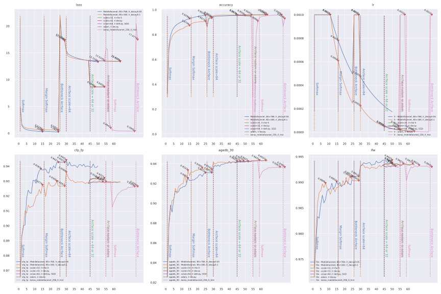
## Mobilefacenet SE
  ```py
  hist_path = "checkpoints/mobilefacenet/"
  pp = {}
  pp["customs"] = ["cfp_fp", "agedb_30", "lfw", "lr", "triplet_embedding_loss", "center_embedding_loss"]
  pp["epochs"] = [15, 10, 4, 30, 10, 10, 10, 20]
  names = ["Softmax", "Margin Softmax", "Bottleneck Arcface", "Arcface scale=64"] + ["Triplet alpha=%g" % ii for ii in [0.35, 0.3, 0.25, 0.2]]
  axes, _ = plot.hist_plot_split(hist_path + "keras_se_mobile_facenet_emore_soft_arc_trip_hist.json", fig_label="se, [softmax + cos, E25], [arc + exp, E30], [triplet, E50]", names=names, **pp)
  pp["axes"] = axes

  pp["epochs"] = [4, 35]
  pre_item = {kk: vv[24] for kk, vv in json.load(open(hist_path + "keras_se_mobile_facenet_emore_soft_arc_trip_hist.json", 'r')).items() if len(vv) > 24}
  pre = {"pre_item": pre_item, "init_epoch": 25}
  axes, _ = plot.hist_plot_split(hist_path + "keras_se_mobile_facenet_emore_soft_arc_cos_hist.json", fig_label="se, [softmax + cos, E25], [arc + cos, E12]", **pre, **pp)
  axes, _ = plot.hist_plot_split(hist_path + "keras_se_mobile_facenet_emore_II_hist.json", fig_label="se, [softmax + cos, E25], [arc + exp + LS0.1, E12]", **pre, **pp, save="se_mobile_facenet_emore.svg")
  ```
  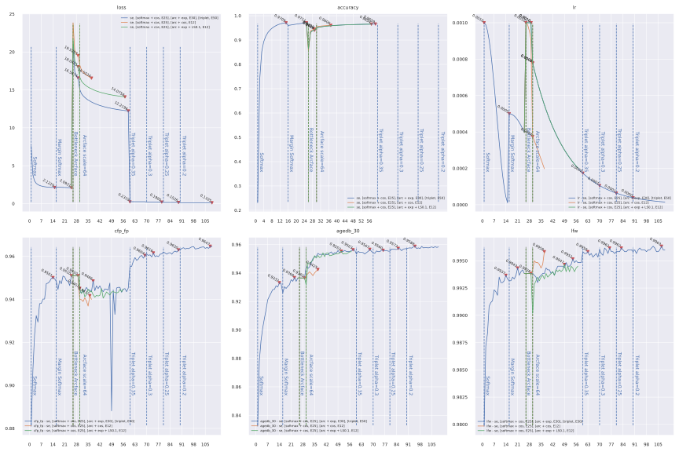
***

# Mobilenet on CASIA
## Combination of adamw and label smoothing and dropout on cifar10
  - [AdamW_Label_smoothing_Dropout_tests.ipynb](AdamW_Label_smoothing_Dropout_tests.ipynb)
## Combination of adamw and dropout and centerloss and triplet on CASIA
  - [Mobilenet_casia_tests.ipynb](Mobilenet_casia_tests.ipynb)
## Combination of nesterov and label smoothing and dropout on CASIA
  ```py
  # Plot baselines
  hist_path = "checkpoints/mobilenet_casia_tests/"
  pp = {}
  pp["epochs"] = [5, 5, 10, 10, 40]
  pp["customs"] = ["cfp_fp", "agedb_30", "lfw", "lr"]
  names = ["ArcFace Scale %d, learning rate %g" %(ss, lr) for ss, lr in zip([16, 32, 64, 64, 64], [0.1, 0.1, 0.1, 0.01, 0.001])]
  axes, _ = plot.hist_plot_split(hist_path + "TT_mobilenet_base_bs400_hist.json", fig_label='Mobilnet, CASIA, emb256, dr0, bs400, base', names=names, **pp)
  pp["axes"] = axes

  axes, _ = plot.hist_plot_split(hist_path + "TT_mobilenet_base_emb512_dr0_bs400_hist.json", fig_label="Mobilenet, emb512, dr0, bs400, base", **pp)
  axes, _ = plot.hist_plot_split(hist_path + "TT_mobilenet_base_emb512_dr4_bs400_hist.json", fig_label="Mobilenet, emb512, dr0.4, bs400, base", **pp)

  # Plot testing nesterov
  axes, _ = plot.hist_plot_split(hist_path + "TT_mobilenet_base_nesterov_emb256_bs400_hist.json", fig_label="Mobilenet, emb256, dr0, bs400, nesterov True", **pp)
  axes, _ = plot.hist_plot_split(hist_path + "TT_mobilenet_base_nesterov_emb512_dr4_bs400_hist.json", fig_label="Mobilenet, emb512, dr0.4, bs400, nesterov True", **pp)

  axes, _ = plot.hist_plot_split(hist_path + "TT_mobilenet_base_ls1_emb256_bs400_hist.json", fig_label="Mobilenet, emb256, dr0, bs400, ls 0.1", **pp)
  axes, _ = plot.hist_plot_split(hist_path + "TT_mobilenet_base_nesterov_ls1_emb256_bs400_hist.json", fig_label="Mobilenet, emb256, dr0, bs400, nesterov True, ls 0.1", **pp, save="mobilenet_casia_bs400_sgdw.svg")

  aa = [
      hist_path + "TT_mobilenet_base_bs400_hist.json",
      hist_path + "TT_mobilenet_base_emb512_dr0_bs400_hist.json",
      hist_path + "TT_mobilenet_base_emb512_dr4_bs400_hist.json",
      hist_path + "TT_mobilenet_base_nesterov_emb256_bs400_hist.json",
      hist_path + "TT_mobilenet_base_nesterov_emb512_dr4_bs400_hist.json",
      hist_path + "TT_mobilenet_base_ls1_emb256_bs400_hist.json",
      hist_path + "TT_mobilenet_base_nesterov_ls1_emb256_bs400_hist.json",
  ]

  choose_accuracy(aa)
  ```
  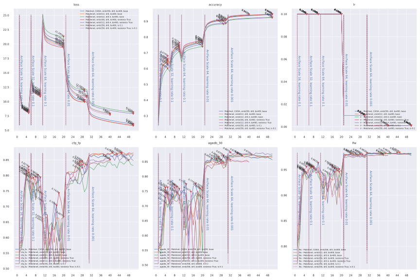

  | emb | Dropout | nesterov | ls  | Max lfw       | Max cfp_fp    | Max agedb_30  |
  | --- | ------- | -------- | --- | ------------- | ------------- | ------------- |
  | 256 | 0       | False    | 0   | 0.9822,38     | 0.8694,44     | 0.8695,36     |
  | 512 | 0       | False    | 0   | **0.9838**,44 | 0.8730,40     | 0.8697,36     |
  | 512 | 0.4     | False    | 0   | 0.9837,43     | 0.8491,47     | 0.8745,40     |
  | 256 | 0       | True     | 0   | 0.9830,30     | **0.8739**,40 | 0.8772,34     |
  | 512 | 0.4     | True     | 0   | 0.9828,40     | 0.8673,42     | **0.8810**,31 |
  | 256 | 0       | False    | 0.1 | 0.9793,35     | 0.8503,39     | 0.8553,30     |
  | 256 | 0       | True     | 0.1 | 0.9788,30     | 0.8511,39     | 0.8560,31     |
## Sub center Result
  ```py
  hist_path = "checkpoints/mobilenet_casia_tests/"
  pp = {}
  pp["epochs"] = [5, 5, 10, 10, 40]
  pp["customs"] = ["cfp_fp", "agedb_30", "lfw", "lr"]
  names = ["ArcFace Scale %d, learning rate %g" %(ss, lr) for ss, lr in zip([16, 32, 64, 64, 64], [0.1, 0.1, 0.1, 0.01, 0.001])]
  axes, _ = plot.hist_plot_split(hist_path + "TT_mobilenet_base_bs400_hist.json", fig_label='Mobilnet, CASIA, baseline, topk1, wdm1', names=names, **pp)
  pp["axes"] = axes

  axes, pre = plot.hist_plot_split(hist_path + "TT_mobilenet_topk_bs400_hist.json", fig_label='topk3, wdm1', **pp)
  axes, _ = plot.hist_plot_split(hist_path + "TT_mobilenet_topk1_bs400_hist.json", fig_label='topk3->1, wdm1', **pp)

  axes, _ = plot.hist_plot_split(hist_path + "TT_mobilenet_topk1_BTNO_bs400_hist.json", fig_label='topk3->1, wdm1, bottleneckOnly', pre_item=pre, **pp)
  axes, _ = plot.hist_plot_split(hist_path + "TT_mobilenet_topk1_BTNO_init_E40_bs400_hist.json", fig_label='topk3->1, wdm1, bottleneckOnly, init_epoch40', pre_item=pre, **pp, save="mobilenet_casia_bs400_subcenter_sgdw.svg")

  import json
  aa = [hist_path + "TT_mobilenet_base_bs400_hist.json",
      hist_path + "TT_mobilenet_topk_bs400_hist.json",
      hist_path + "TT_mobilenet_topk1_bs400_hist.json",
      hist_path + "TT_mobilenet_topk1_BTNO_bs400_hist.json",
      hist_path + "TT_mobilenet_topk1_BTNO_init_E40_bs400_hist.json",
  ]

  choose_accuracy(aa)
  ```
  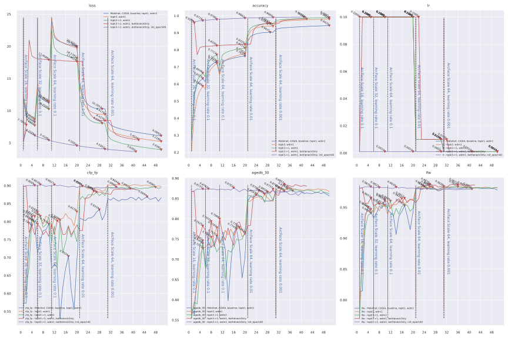

  | Scenario                                    | Max lfw    | Max cfp_fp | Max agedb_30 |
  | ------------------------------------------- | ---------- | ---------- | ------------ |
  | Baseline, topk 1                            | 0.9822     | 0.8694     | 0.8695       |
  | TopK 3                                      | 0.9838     | **0.9044** | 0.8743       |
  | TopK 3->1                                   | 0.9838     | 0.8960     | 0.8768       |
  | TopK 3->1, bottleneckOnly, initial_epoch=0  | **0.9878** | 0.8920     | **0.8857**   |
  | TopK 3->1, bottleneckOnly, initial_epoch=40 | 0.9835     | **0.9030** | 0.8763       |
## Distillation Result
```py
pp = {}
pp["epochs"] = [5, 5, 10, 10, 40]
pp["customs"] = ["cfp_fp", "agedb_30", "lfw", "lr", "distill_embedding_loss", "arcface_loss"]
names = ["ArcFace Scale %d, learning rate %g" %(ss, lr) for ss, lr in zip([16, 32, 64, 64, 64], [0.1, 0.1, 0.1, 0.01, 0.001])]
axes, _ = plot.hist_plot_split("checkpoints/TT_mobilenet_distill_emb512_dr0_bs400_r100_subcenter_hist.json", names=names, **pp, fig_label="mobilenet CASIA, SGDW, emb512, distill 128 + arc")
pp["axes"] = axes

axes, _ = plot.hist_plot_split("checkpoints/TT_mobilenet_distill_128_emb256_dr0_arc_bs400_r100_hist.json", **pp, fig_label="mobilenet CASIA, SGDW, emb256, distill 128 + arc")
axes, _ = plot.hist_plot_split("checkpoints/TT_mobilenet_distill_cos_only_emb512_dr4_bs400_r100_adamw_hist.json", **pp, fig_label="mobilenet CASIA, AdamW, emb512, distill_loss_cosine only")
axes, _ = plot.hist_plot_split("checkpoints/TT_mobilenet_distill_eucd_only_emb512_dr4_bs400_r100_adamw_hist.json", **pp, fig_label="mobilenet CASIA, AdamW, emb512, distill_loss_euclidean only")
axes, _ = plot.hist_plot_split("checkpoints/TT_mobilenet_distill_eucd_only_emb512_dr4_bs400_r100_hist.json", **pp, fig_label="mobilenet CASIA, SGDW, emb512, distill_loss_euclidean only")
# axes, _ = plot.hist_plot_split("checkpoints/TT_mobilenet_distill_emb512_dr0_bs400_r100_subcenter_exp02_hist.json", **pp)
axes, _ = plot.hist_plot_split("checkpoints/TT_mobilenet_distill_emb512_dr0_bs400_r100_subcenter_pick_3_hist.json", **pp, fig_label="mobilenet CASIA, SGDW, emb512, distill 128 + arc, pick min_dist 0.3")

# axes, _ = plot.hist_plot_split("checkpoints/TT_mobilenet_distill_eucd_only_emb512_dr4_bs400_r100_adamw_lr1e1_hist.json", **pp)
axes, _ = plot.hist_plot_split("checkpoints//TT_mobilenet_distill_128_emb256_dr04_arc_bs400_r100_hist.json", **pp)
# axes, _ = plot.hist_plot_split("checkpoints//TT_mobilenet_distill_euc_tripEuc_emb512_dr04_admw_bs400_r100_subcenter_hist.json", **pp)
axes, _ = plot.hist_plot_split("checkpoints//TT_mobilenet_distill_10_tripcos_emb512_dr04_admw_bs400_r100_subcenter_hist.json", **pp)

# axes, _ = plot.hist_plot_split("checkpoints//TT_mobilenet_distill_cos_only_emb512_dr4_bs400_r100_adamw_random3_hist.json", **pp)
# axes, _ = plot.hist_plot_split("checkpoints//TT_mobilenet_distill_trip_emb512_dr04_bs400_r100_subcenter_hist.json", **pp)
# axes, _ = plot.hist_plot_split("checkpoints//TT_mobilenet_distill_128_emb512_dr04_arc_bs400_r100_random3_hist.json", **pp)
```
```py
aa = [
  "checkpoints/TT_mobilenet_distill_emb512_dr0_bs400_r100_subcenter_hist.json",
  "checkpoints/TT_mobilenet_distill_128_emb256_dr0_arc_bs400_r100_hist.json",
  "checkpoints/TT_mobilenet_distill_cos_only_emb512_dr4_bs400_r100_adamw_hist.json",
  "checkpoints/TT_mobilenet_distill_eucd_only_emb512_dr4_bs400_r100_adamw_hist.json",
  "checkpoints/TT_mobilenet_distill_eucd_only_emb512_dr4_bs400_r100_hist.json",
  "checkpoints/TT_mobilenet_distill_emb512_dr0_bs400_r100_subcenter_pick_3_hist.json",
  "checkpoints//TT_mobilenet_distill_128_emb256_dr04_arc_bs400_r100_hist.json",
  "checkpoints//TT_mobilenet_distill_10_tripcos_emb512_dr04_admw_bs400_r100_subcenter_hist.json",
]
```
  ```py
  hist_path = "checkpoints/mobilenet_casia_tests/"
  pp = {}
  pp["epochs"] = [5, 5, 10, 10, 40]
  pp["customs"] = ["cfp_fp", "agedb_30", "lfw", "lr"]
  names = ["ArcFace Scale %d, learning rate %g" %(ss, lr) for ss, lr in zip([16, 32, 64, 64, 64], [0.1, 0.1, 0.1, 0.01, 0.001])]
  axes, _ = plot.hist_plot_split(hist_path + "TT_mobilenet_base_emb512_dr0_bs400_hist.json", fig_label="Mobilenet, emb512, dr0, bs400, base", names=names, **pp)
  pp["axes"] = axes

  axes, _ = plot.hist_plot_split(hist_path + "TT_mobilenet_base_emb512_dr4_bs400_hist.json", fig_label="Mobilenet, emb512, dr0.4, bs400, base", **pp)

  axes, _ = plot.hist_plot_split(hist_path + "TT_mobilenet_distill_emb512_dr0_bs400_hist.json", fig_label="Mobilenet, emb512, dr0, bs400, Teacher r34", **pp)

  axes, _ = plot.hist_plot_split(hist_path + "TT_mobilenet_distill_emb512_dr0_bs400_r100_hist.json", fig_label="Mobilenet, emb512, dr0, bs400, Teacher r100", **pp)
  axes, _ = plot.hist_plot_split(hist_path + "TT_mobilenet_distill_emb512_dr4_bs400_2_hist.json", fig_label="Mobilenet, emb512, dr0.4, bs400, Teacher r100", **pp)

  axes, _ = plot.hist_plot_split(hist_path + "TT_mobilenet_distill_64_emb512_dr4_adamw_lr1e3_arcT4_bs400_r100_hist.json", fig_label="Mobilenet, emb512, dr0.4, distill 64, bs400, arcT4, adamw, Teacher r100", **pp)
  axes, _ = plot.hist_plot_split("checkpoints/TT_mobilenet_distill_emb512_dr0_bs400_r100_subcenter_hist.json", **pp)
  axes, _ = plot.hist_plot_split(hist_path + "TT_mobilenet_distill_64_emb512_dr4_arcT4_bs400_r100_hist.json", fig_label="Mobilenet, emb512, dr0.4, distill 64, bs400, arcT4, Teacher r100", **pp, save="mobilenet_casia_bs400_subcenter_distill.svg")

  aa = [
      hist_path + "TT_mobilenet_base_emb512_dr0_bs400_hist.json",
      hist_path + "TT_mobilenet_base_emb512_dr4_bs400_hist.json",
      hist_path + "TT_mobilenet_distill_emb512_dr0_bs400_hist.json",
      hist_path + "TT_mobilenet_distill_emb512_dr0_bs400_r100_hist.json",
      hist_path + "TT_mobilenet_distill_emb512_dr4_bs400_2_hist.json",
      hist_path + "TT_mobilenet_distill_64_emb512_dr4_adamw_lr1e3_arcT4_bs400_r100_hist.json",
      hist_path + "TT_mobilenet_distill_64_emb512_dr4_arcT4_bs400_r100_hist.json",
  ]

  choose_accuracy(aa)
  ```
  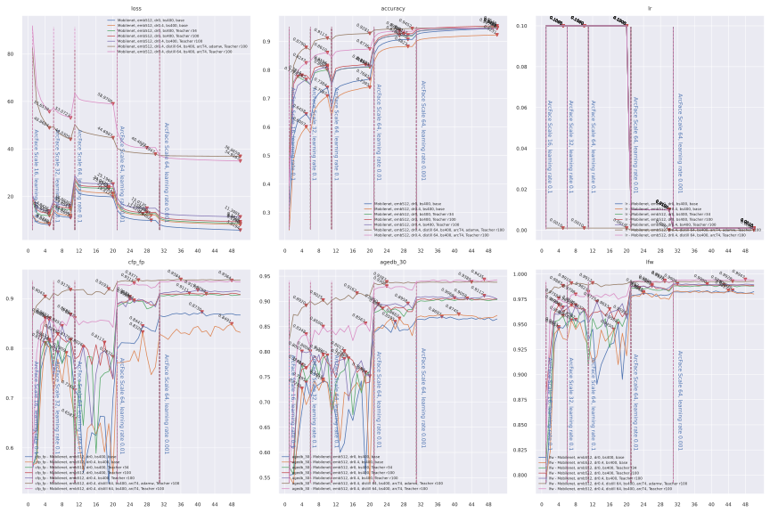

  | Teacher | Dropout | Optimizer | distill | Max lfw    | Max cfp_fp | Max agedb_30 |
  | ------- | ------- | --------- | ------- | ---------- | ---------- | ------------ |
  | None    | 0       | SGDW      | 0       | 0.9838     | 0.8730     | 0.8697       |
  | None    | 0.4     | SGDW      | 0       | 0.9837     | 0.8491     | 0.8745       |
  | r34     | 0       | SGDW      | 7       | 0.9890     | 0.9099     | 0.9058       |
  | r100    | 0       | SGDW      | 7       | 0.9900     | 0.9111     | 0.9068       |
  | r100    | 0.4     | SGDW      | 7       | 0.9905     | 0.9170     | 0.9112       |
  | r100    | 0.4     | SGDW      | 64      | **0.9938** | 0.9333     | **0.9435**   |
  | r100    | 0.4     | AdamW     | 64      | 0.9920     | **0.9346** | 0.9387       |
## MSE Dense
  ```py
  hist_path = "checkpoints/mobilenet_casia_tests/"
  pp = {}
  pp["epochs"] = [5, 5, 10, 10, 40]
  pp["customs"] = ["cfp_fp", "agedb_30", "lfw", "lr"]
  names = ["ArcFace Scale %d, learning rate %g" %(ss, lr) for ss, lr in zip([16, 32, 64, 64, 64], [0.1, 0.1, 0.1, 0.01, 0.001])]
  axes, _ = plot.hist_plot_split(hist_path + "TT_mobilenet_base_bs400_hist.json", fig_label='Mobilnet, CASIA, emb256, dr0, bs400, base', names=names, **pp)
  pp["axes"] = axes

  axes, _ = plot.hist_plot_split(hist_path + "TT_mobilenet_MSEDense_margin_softmax_sgdw_5e4_emb256_dr0_bs400_hist.json", **pp)
  ```
***

# IJB
  ```py
  $ time CUDA_VISIBLE_DEVICES='1' python IJB_evals.py -m '/media/SD/tdtest/IJB_release/pretrained_models/MS1MV2-ResNet100-Arcface/model,0' -L -d /media/SD/tdtest/IJB_release -B -b 64 -F
  >>>> loading mxnet model: /media/SD/tdtest/IJB_release/pretrained_models/MS1MV2-ResNet100-Arcface/model 0 [gpu(0)]
  [09:17:15] src/nnvm/legacy_json_util.cc:209: Loading symbol saved by previous version v1.2.0. Attempting to upgrade...
  [09:17:15] src/nnvm/legacy_json_util.cc:217: Symbol successfully upgraded!
  >>>> Loading templates and medias...
  templates: (227630,), medias: (227630,), unique templates: (12115,)
  >>>> Loading pairs...
  p1: (8010270,), unique p1: (1845,)
  p2: (8010270,), unique p2: (10270,)
  label: (8010270,), label value counts: {0: 8000000, 1: 10270}
  >>>> Loading images...
  img_names: (227630,), landmarks: (227630, 5, 2), face_scores: (227630,)
  face_scores value counts: {0.1: 2515, 0.2: 0, 0.3: 62, 0.4: 94, 0.5: 136, 0.6: 197, 0.7: 291, 0.8: 538, 0.9: 223797}
  >>>> Saving backup to: /media/SD/IJB_release/IJBB_backup.npz ...

  Embedding: 100%|██████████████████████████████████████████████████████████████████████████████████████████████| 3557/3557 [17:00<00:00,  3.48it/s]
  >>>> N1D1F1 True True True
  Extract template feature: 100%|███████████████████████████████████████████████████████████████████████████| 12115/12115 [00:02<00:00, 4948.45it/s]
  Verification: 100%|███████████████████████████████████████████████████████████████████████████████████████████████| 81/81 [00:39<00:00,  2.04it/s]
  >>>> N1D1F0 True True False
  Extract template feature: 100%|███████████████████████████████████████████████████████████████████████████| 12115/12115 [00:02<00:00, 5010.94it/s]
  Verification: 100%|███████████████████████████████████████████████████████████████████████████████████████████████| 81/81 [00:38<00:00,  2.12it/s]
  >>>> N1D0F1 True False True
  Extract template feature: 100%|███████████████████████████████████████████████████████████████████████████| 12115/12115 [00:02<00:00, 5018.59it/s]
  Verification: 100%|███████████████████████████████████████████████████████████████████████████████████████████████| 81/81 [00:38<00:00,  2.12it/s]
  >>>> N1D0F0 True False False
  Extract template feature: 100%|███████████████████████████████████████████████████████████████████████████| 12115/12115 [00:02<00:00, 4994.06it/s]
  Verification: 100%|███████████████████████████████████████████████████████████████████████████████████████████████| 81/81 [00:38<00:00,  2.13it/s]
  >>>> N0D1F1 False True True
  Extract template feature: 100%|███████████████████████████████████████████████████████████████████████████| 12115/12115 [00:02<00:00, 4984.76it/s]
  Verification: 100%|███████████████████████████████████████████████████████████████████████████████████████████████| 81/81 [00:38<00:00,  2.12it/s]
  >>>> N0D1F0 False True False
  Extract template feature: 100%|███████████████████████████████████████████████████████████████████████████| 12115/12115 [00:02<00:00, 4997.04it/s]
  Verification: 100%|███████████████████████████████████████████████████████████████████████████████████████████████| 81/81 [00:38<00:00,  2.12it/s]
  >>>> N0D0F1 False False True
  Extract template feature: 100%|███████████████████████████████████████████████████████████████████████████| 12115/12115 [00:02<00:00, 4992.75it/s]
  Verification: 100%|███████████████████████████████████████████████████████████████████████████████████████████████| 81/81 [00:38<00:00,  2.12it/s]
  >>>> N0D0F0 False False False
  Extract template feature: 100%|███████████████████████████████████████████████████████████████████████████| 12115/12115 [00:02<00:00, 5007.00it/s]
  Verification: 100%|███████████████████████████████████████████████████████████████████████████████████████████████| 81/81 [00:38<00:00,  2.12it/s]
  |                                      |    1e-06 |    1e-05 |   0.0001 |    0.001 |     0.01 |      0.1 |
  |:-------------------------------------|---------:|---------:|---------:|---------:|---------:|---------:|
  | MS1MV2-ResNet100-Arcface_IJBB_N1D1F1 | 0.408861 | 0.899513 | 0.946349 | 0.964167 | 0.976144 | 0.98666  |
  | MS1MV2-ResNet100-Arcface_IJBB_N1D1F0 | 0.389192 | 0.898442 | 0.94557  | 0.96261  | 0.975268 | 0.986076 |
  | MS1MV2-ResNet100-Arcface_IJBB_N1D0F1 | 0.402142 | 0.893184 | 0.943622 | 0.963096 | 0.975755 | 0.986173 |
  | MS1MV2-ResNet100-Arcface_IJBB_N1D0F0 | 0.382765 | 0.893281 | 0.942454 | 0.961538 | 0.975073 | 0.985589 |
  | MS1MV2-ResNet100-Arcface_IJBB_N0D1F1 | 0.42814  | 0.908179 | 0.948978 | 0.964654 | 0.976728 | 0.986563 |
  | MS1MV2-ResNet100-Arcface_IJBB_N0D1F0 | 0.392989 | 0.903895 | 0.947614 | 0.962999 | 0.975755 | 0.986076 |
  | MS1MV2-ResNet100-Arcface_IJBB_N0D0F1 | 0.425998 | 0.907011 | 0.947809 | 0.96446  | 0.976436 | 0.986563 |
  | MS1MV2-ResNet100-Arcface_IJBB_N0D0F0 | 0.389971 | 0.904187 | 0.946738 | 0.962025 | 0.976144 | 0.985979 |

  real    23m36.871s
  user    68m56.171s
  sys     138m6.504s
  ```
  ```py
  CUDA_VISIBLE_DEVICES='1' ./IJB_evals.py -m checkpoints/keras_mobilenet_emore_adamw_5e5_soft_baseline_basic_agedb_30_epoch_116_0.958000.h5 -d ~/workspace/IJB_release/
  CUDA_VISIBLE_DEVICES='1' ./IJB_evals.py -m checkpoints/keras_mobilenet_emore_adamw_5e5_soft_baseline_before_arc_E80_BTO_E2_arc_basic_agedb_30_epoch_117_batch_10000_0.956000.h5 -d ~/workspace/IJB_release/
  CUDA_VISIBLE_DEVICES='1' ./IJB_evals.py -m checkpoints/keras_mobilenet_emore_adamw_5e5_soft_centerD_type_sum_E80_arc_MSEtripD_basic_agedb_30_epoch_1_batch_10000_0.956500.h5 -d ~/workspace/IJB_release/

  CUDA_VISIBLE_DEVICES='1' ./IJB_evals.py -m ./checkpoints/keras_mobilenet_emore_adamw_5e5_soft_baseline_basic_agedb_30_epoch_107_0.957167.h5 -d ~/workspace/IJB_release/
  CUDA_VISIBLE_DEVICES='1' ./IJB_evals.py -m checkpoints/keras_mobilenet_emore_adamw_5e5_soft_centerD_type_sum_E80_BTO_E2_arc_basic_agedb_30_epoch_104_0.955333.h5 -d ~/workspace/IJB_release/
  CUDA_VISIBLE_DEVICES='1' ./IJB_evals.py -m checkpoints/keras_mobilenet_emore_adamw_5e5_soft_baseline_before_arc_E80_BTO_E2_arc_basic_agedb_30_epoch_97_batch_20000_0.955333.h5 -d ~/workspace/IJB_release/

  PYTHONPATH="$PYTHONPATH:/usr/local/cuda-10.1/targets/x86_64-linux/lib" CUDA_VISIBLE_DEVICES='1' ./IJB_evals.py -m /media/SD/tdtest/partial_fc/mxnet/glint360k_r100FC_0.1_fp16_cosface8GPU/model,0 -d /datasets/IJB_release/ -s IJBB
  PYTHONPATH="$PYTHONPATH:/opt/anaconda3/lib" CUDA_VISIBLE_DEVICES='1' ./IJB_evals.py -m /media/SD/tdtest/partial_fc/mxnet/glint360k_r100FC_0.1_fp16_cosface8GPU/model,0 -d /datasets/IJB_release/ -s IJBB
  ```
|                                                                      |    1e-06 |    1e-05 |   0.0001 |    0.001 |     0.01 |      0.1 |
|:-------------------------------------------------------------------- | --------:| --------:| --------:| --------:| --------:| --------:|
| MS1MV2-ResNet100-Arcface_IJBB_N0D1F1                                 |  0.42814 | 0.908179 | 0.948978 | 0.964654 | 0.976728 | 0.986563 |
| r100-arcface-msfdrop75_IJBB                                          | 0.441772 | 0.905063 | 0.949464 | 0.965823 | 0.978578 | 0.988802 |
| glint360k_r100FC_1.0_fp16_cosface8GPU_model_IJBB                     | 0.460857 | 0.938364 | 0.962317 | 0.970789 |  0.98111 | 0.988023 |
| glint360k_r100FC_1.0_fp16_cosface8GPU_model_average_IJBB             | 0.464849 | 0.937001 |  0.96222 | 0.970789 | 0.981597 | 0.988023 |
| glint360k_r100FC_0.1_fp16_cosface8GPU_model_IJBB                     | 0.450536 | 0.931938 | 0.961928 | 0.972639 | 0.981986 | 0.989679 |
| glint360k_r100FC_0.1_fp16_cosface8GPU_model_average_IJBB             |  0.44742 | 0.932619 | 0.961831 | 0.972833 | 0.982278 | 0.989971 |
| GhostNet_x1.3_Arcface_Epoch_24_IJBB                                  | 0.352678 | 0.881694 | 0.928724 | 0.954041 | 0.972055 | 0.985784 |
| glint360k_r100FC_1.0_fp16_cosface8GPU_IJBC                           | 0.872066 | 0.961497 | 0.973871 | 0.980672 | 0.987421 | 0.991819 |
| keras_ResNest101_emore_triplet_basic_agedb_30_epoch_96_0.973333_IJBB | 0.374294 | 0.762025 | 0.895813 | 0.944012 | 0.974878 | 0.991431 |

|                                                                                                                                                        |        1e-06 |        1e-05 |       0.0001 |        0.001 |         0.01 |          0.1 |
|:------------------------------------------------------------------------------------------------------------------------------------------------------ | ------------:| ------------:| ------------:| ------------:| ------------:| ------------:|
| mobilenet_adamw_BS256_E80_arc_tripD_basic_agedb_30_epoch_123_0.955333_IJBB                                                                             |     0.342843 |     0.741577 |     0.865141 |     0.932522 |     0.965433 |      0.98481 |
| keras_mobilenet_emore_adamw_5e5_soft_centerD_type_sum_E80_arc_MSEtripD_basic_agedb_30_epoch_1_batch_10000_0.956333_IJBB_N0D1F1                         |     0.362804 |     0.719182 |     0.848491 |     0.919182 | **0.964752** | **0.987829** |
| keras_mobilenet_emore_adamw_5e5_soft_centerD_type_sum_E80_arc_MSEtripD_basic_agedb_30_epoch_1_batch_10000_0.956500_IJBB                                | **0.383447** |      0.72444 |      0.85667 |     0.921324 |      0.96592 |     0.987342 |
| keras_mobilenet_emore_adamw_5e5_soft_centerD_type_sum_E80_BTO_E2_arc_basic_agedb_30_epoch_104_0.955333_IJBB_N0D1F1                                     |     0.228627 |     0.536319 |     0.738656 |     0.856962 |     0.930769 |     0.974684 |
| keras_mobilenet_emore_adamw_5e5_soft_centerD_type_sum_arc_tripD_basic_agedb_30_epoch_108_0.956833_IJBB_N0D1F1                                          |     0.285102 |      0.57517 |     0.735443 |     0.848588 |      0.92259 |     0.972249 |
| keras_mobilenet_emore_adamw_5e5_soft_baseline_basic_agedb_30_epoch_107_0.957167_IJBB_N0D1F1                                                            |      0.33038 |     0.716456 |     0.857838 |     0.925609 |     0.962999 |     0.984713 |
| keras_mobilenet_emore_adamw_5e5_soft_baseline_basic_agedb_30_epoch_116_0.958000_IJBB                                                                   |     0.346251 |     0.710808 |     0.860273 |     0.930964 |     0.964167 |     0.984129 |
| keras_mobilenet_emore_adamw_5e5_soft_baseline_before_arc_E80_BTO_E2_arc_basic_agedb_30_epoch_97_batch_20000_0.955333_IJBB_N0D1F1                       |     0.351022 |     0.746056 |     0.869036 |      0.92814 |     0.962512 |     0.983057 |
| keras_mobilenet_emore_adamw_5e5_soft_baseline_before_arc_E80_BTO_E2_arc_basic_agedb_30_epoch_117_batch_10000_0.956000_IJBB                             |     0.368452 | **0.781305** | **0.879942** |     0.931159 |     0.961928 |     0.981597 |
| keras_mobilenet_emore_adamw_5e5_soft_baseline_before_arc_E80_BTO_E2_arc_MSEtrip_auto_alpha_basic_agedb_30_epoch_112_0.958167_IJBB                      |     0.340701 |     0.707011 |     0.854138 |     0.930088 |     0.966894 |     0.988023 |
| keras_mobilenet_emore_adamw_5e5_soft_baseline_before_arc_E80_BTO_E2_arc_MSEtrip_auto_alpha_E120_arc_basic_agedb_30_epoch_123_0.952000_IJBB             |     0.346835 |     0.759396 |     0.876534 | **0.932717** |     0.962804 |     0.982278 |
| keras_mobilenet_emore_adamw_5e5_soft_baseline_before_arc_E80_BTO_E2_arc_MSEtrip_auto_alpha_E120_MSEtrip_basic_agedb_30_epoch_134_0.959167_IJBB         |      0.29036 |     0.660954 |     0.818793 |      0.91889 |     0.967381 |     0.990944 |
| keras_mobilenet_emore_adamw_5e5_soft_baseline_before_arc_E80_BTO_E2_arc_MSEtrip_auto_alpha_E120_MSEtrip_alpha30_basic_agedb_30_epoch_130_0.959000_IJBB |     0.264946 |     0.619182 |     0.774781 |     0.875365 |     0.924635 |     0.948296 |
| keras_mobilenet_PRELU_emore_adamw_5e5_soft_basic_agedb_30_epoch_58_0.945000_IJBB                                                                       |     0.354528 |       0.6963 |     0.836514 |     0.911003 |     0.963681 |     0.986758 |
| keras_mobilenet_PRELU_emore_adamw_5e5_soft_E80_arc_MSE_trip_basic_agedb_30_epoch_100_0.956833_IJBB                                                     |      0.27926 |     0.714508 |     0.860175 |     0.927361 | **0.967965** |     0.986952 |
***
# Ali Datasets
  ```py
  import cv2
  import shutil
  import glob2
  from tqdm import tqdm
  from skimage.transform import SimilarityTransform
  from sklearn.preprocessing import normalize

  def face_align_landmarks(img, landmarks, image_size=(112, 112)):
      ret = []
      for landmark in landmarks:
          src = np.array(
              [[38.2946, 51.6963], [73.5318, 51.5014], [56.0252, 71.7366], [41.5493, 92.3655], [70.729904, 92.2041]],
              dtype=np.float32,
          )

          if image_size[0] != 112:
              src *= image_size[0] / 112
              src[:, 0] += 8.0

          dst = landmark.astype(np.float32)
          tform = SimilarityTransform()
          tform.estimate(dst, src)
          M = tform.params[0:2, :]
          ret.append(cv2.warpAffine(img, M, (image_size[1], image_size[0]), borderValue=0.0))

      return np.array(ret)

  def extract_face_images(source_reg, dest_path, detector, limit=-1):
      aa = glob2.glob(source_reg)
      dest_single = dest_path
      dest_multi = dest_single + '_multi'
      dest_none = dest_single + '_none'
      os.makedirs(dest_none, exist_ok=True)
      if limit != -1:
          aa = aa[:limit]
      for ii in tqdm(aa):
          imm = imread(ii)
          bbs, pps = detector(imm)
          if len(bbs) == 0:
              shutil.copy(ii, os.path.join(dest_none, '_'.join(ii.split('/')[-2:])))
              continue
          user_name, image_name = ii.split('/')[-2], ii.split('/')[-1]
          if len(bbs) == 1:
              dest_path = os.path.join(dest_single, user_name)
          else:
              dest_path = os.path.join(dest_multi, user_name)

          if not os.path.exists(dest_path):
              os.makedirs(dest_path)
          # if len(bbs) != 1:
          #     shutil.copy(ii, dest_path)

          nns = face_align_landmarks(imm, pps)
          image_name_form = '%s_{}.%s' % tuple(image_name.split('.'))
          for id, nn in enumerate(nns):
              dest_name = os.path.join(dest_path, image_name_form.format(id))
              imsave(dest_name, nn)

  import insightface
  os.environ['MXNET_CUDNN_AUTOTUNE_DEFAULT'] = '0'
  # retina = insightface.model_zoo.face_detection.retinaface_mnet025_v1()
  retina = insightface.model_zoo.face_detection.retinaface_r50_v1()
  retina.prepare(0)
  detector = lambda imm: retina.detect(imm)

  sys.path.append('/home/leondgarse/workspace/samba/tdFace-flask')
  from face_model.face_model import FaceModel
  det = FaceModel(None)

  def detector(imm):
      bbox, confid, points  = det.get_face_location(imm)
      return bbox, points
  extract_face_images("./face_image/*/*.jpg", 'tdevals', detector)
  extract_face_images("./tdface_Register/*/*.jpg", 'tdface_Register_cropped', detector)
  extract_face_images("./tdface_Register/*/*.jpg", 'tdface_Register_mtcnn', detector)

  ''' Review _multi and _none folder by hand, then do detection again on _none folder using another detector '''
  inn = glob2.glob('tdface_Register_mtcnn_none/*.jpg')
  for ii in tqdm(inn):
      imm = imread(ii)
      bbs, pps = detector(imm)
      if len(bbs) != 0:
          image_name = os.path.basename(ii)
          user_name = image_name.split('_')[0]
          dest_path = os.path.join(os.path.dirname(ii), user_name)
          os.makedirs(dest_path, exist_ok=True)
          nns = face_align_landmarks(imm, pps)
          image_name_form = '%s_{}.%s' % tuple(image_name.split('.'))
          for id, nn in enumerate(nns):
              dest_name = os.path.join(dest_path, image_name_form.format(id))
              imsave(dest_name, nn)
              os.rename(ii, os.path.join(dest_path, image_name))

  print(">>>> 提取特征值")
  model_path = "/home/tdtest/workspace/Keras_insightface/checkpoints/keras_resnet101_emore_II_triplet_basic_agedb_30_epoch_107_0.971000.h5"
  model = tf.keras.models.load_model(model_path, compile=False)
  interp = lambda ii: normalize(model.predict((np.array(ii) - 127.5) / 127))
  register_path = 'tdface_Register_mtcnn'

  backup_file = 'tdface_Register_mtcnn.npy'
  if os.path.exists(backup_file):
      imms = np.load('tdface_Register_mtcnn.npy')
  else:
      imms = glob2.glob(os.path.join(register_path, "*/*.jpg"))
      np.save('tdface_Register_mtcnn.npy', imms)

  batch_size = 64
  steps = int(np.ceil(len(imms) / batch_size))
  embs = []
  for ii in tqdm(range(steps), total=steps):
      ibb = imms[ii * batch_size : (ii + 1) * batch_size]
      embs.append(interp([imread(jj) for jj in ibb]))

  embs = np.concatenate(embs)
  dd, pp = {}, {}
  for ii, ee in zip(imms, embs):
      user = os.path.basename(os.path.dirname(ii))
      dd[user] = np.vstack([dd.get(user, np.array([]).reshape(0, embs.shape[-1])), [ee]])
      pp[user] = np.hstack([pp.get(user, []), ii])
  # dd_bak = dd.copy()
  # pp_bak = pp.copy()
  print("Total: %d" % (len(dd)))

  print(">>>> 合并组间距离过小的成员")
  OUT_THREASH = 0.7
  tt = dd.copy()
  while len(tt) > 0:
      kk, vv = tt.popitem()
      # oo = np.vstack(list(tt.values()))
      for ikk, ivv in tt.items():
          imax = np.dot(vv, ivv.T).max()
          if imax > OUT_THREASH:
              print("First: %s, Second: %s, Max dist: %.4f" % (kk, ikk, imax))
              if kk in dd and ikk in dd:
                  dd[kk] = np.vstack([dd[kk], dd[ikk]])
                  dd.pop(ikk)
                  pp[kk] = np.hstack([pp[kk], pp[ikk]])
                  pp.pop(ikk)
  # print([kk for kk, vv in pp.items() if vv.shape[0] != dd[kk].shape[0]])
  print("Total left: %d" % (len(dd)))

  ''' Similar images between users '''
  src = 'tdface_Register_mtcnn'
  dst = 'tdface_Register_mtcnn_simi'
  with open('tdface_Register_mtcnn.foo', 'r') as ff:
      aa = ff.readlines()
  for id, ii in tqdm(enumerate(aa), total=len(aa)):
      first, second, simi = [jj.split(': ')[1] for jj in ii.strip().split(', ')]
      dest_path = os.path.join(dst, '_'.join([str(id), first, second, simi]))
      os.makedirs(dest_path, exist_ok=True)
      for pp in os.listdir(os.path.join(src, first)):
          src_path = os.path.join(src, first, pp)
          shutil.copy(src_path, os.path.join(dest_path, first + '_' + pp))
      for pp in os.listdir(os.path.join(src, second)):
          src_path = os.path.join(src, second, pp)
          shutil.copy(src_path, os.path.join(dest_path, second + '_' + pp))

  ''' Pos & Neg dists '''
  batch_size = 128
  gg = ImageDataGenerator(rescale=1./255, preprocessing_function=lambda img: (img - 0.5) * 2)
  tt = gg.flow_from_directory('./tdevals', target_size=(112, 112), batch_size=batch_size)
  steps = int(np.ceil(tt.classes.shape[0] / batch_size))
  embs = []
  classes = []
  for _ in tqdm(range(steps), total=steps):
      aa, bb = tt.next()
      emb = interp(aa)
      embs.extend(emb)
      classes.extend(np.argmax(bb, 1))
  embs = np.array(embs)
  classes = np.array(classes)
  class_matrix = np.equal(np.expand_dims(classes, 0), np.expand_dims(classes, 1))
  dists = np.dot(embs, embs.T)
  pos_dists = np.where(class_matrix, dists, np.ones_like(dists))
  neg_dists = np.where(np.logical_not(class_matrix), dists, np.zeros_like(dists))
  (neg_dists.max(1) <= pos_dists.min(1)).sum()
  ```
  ```py
  import glob2
  def dest_test(aa, bb, model, reg_path="./tdface_Register_mtcnn"):
      ees = []
      for ii in [aa, bb]:
          iee = glob2.glob(os.path.join(reg_path, ii, "*.jpg"))
          iee = [imread(jj) for jj in iee]
          ees.append(normalize(model.predict((np.array(iee) / 255. - 0.5) * 2)))
      return np.dot(ees[0], ees[1].T)

  with open('tdface_Register_mtcnn_0.7.foo', 'r') as ff:
      aa = ff.readlines()
  for id, ii in enumerate(aa):
      first, second, simi = [jj.split(': ')[1] for jj in ii.strip().split(', ')]
      dist = dest_test(first, second, model)
      if dist < OUT_THREASH:
          print(("first = %s, second = %s, simi = %s, model_simi = %f" % (first, second, simi, dist)))
  ```
  ```sh
  cp ./face_image/2818/1586472495016.jpg ./face_image/4609/1586475252234.jpg ./face_image/3820/1586472950858.jpg ./face_image/4179/1586520054080.jpg ./face_image/2618/1586471583221.jpg ./face_image/6696/1586529149923.jpg ./face_image/5986/1586504872276.jpg ./face_image/1951/1586489518568.jpg ./face_image/17/1586511238696.jpg ./face_image/17/1586511110105.jpg ./face_image/17/1586511248992.jpg ./face_image/4233/1586482466485.jpg ./face_image/5500/1586493019872.jpg ./face_image/4884/1586474119164.jpg ./face_image/5932/1586471784905.jpg ./face_image/7107/1586575911740.jpg ./face_image/4221/1586512334133.jpg ./face_image/5395/1586578437529.jpg ./face_image/4204/1586506059923.jpg ./face_image/4053/1586477985553.jpg ./face_image/7168/1586579239307.jpg ./face_image/7168/1586489559660.jpg ./face_image/5477/1586512847480.jpg ./face_image/4912/1586489637333.jpg ./face_image/5551/1586502762688.jpg ./face_image/5928/1586579219121.jpg ./face_image/6388/1586513897953.jpg ./face_image/4992/1586471873460.jpg ./face_image/5934/1586492793214.jpg ./face_image/5983/1586490703112.jpg ./face_image/5219/1586492929098.jpg ./face_image/5203/1586487204198.jpg ./face_image/6099/1586490074263.jpg ./face_image/5557/1586490232722.jpg ./face_image/4067/1586491778846.jpg ./face_image/4156/1586512886040.jpg ./face_image/5935/1586492829221.jpg ./face_image/2735/1586513495061.jpg ./face_image/5264/1586557233625.jpg ./face_image/1770/1586470942329.jpg ./face_image/7084/1586514100804.jpg ./face_image/5833/1586497276529.jpg ./face_image/2200/1586577699180.jpg tdevals_none
  ```
***

# Match model layers
```py
# tt = keras.models.load_model('checkpoints/resnet101/TF_resnet101v2_E_sgdw_5e5_dr4_lr1e1_random0_arc32_E5_arc_BS512_emore_basic_agedb_30_epoch_20_batch_2000_0.973000.h5')
tt = train.buildin_models('r100')
ss = train.buildin_models('mobilenet')

aa = [ii.output_shape[1:] for ii in tt.layers[1:]]
bb = [ii.output_shape[1:] for ii in ss.layers[1:]]
cc = set(aa).intersection(set(bb))

ppt = {id: (id / len(tt.layers), ii.name, ii.output_shape[1:]) for id, ii in enumerate(tt.layers[1:]) if ii.output_shape[1:] in cc}
ddt = {ii: [jj[0] for jj in ppt.values() if ii in jj] for ii in cc}
{kk: (min(vv), max(vv)) for kk, vv in ddt.items()}

# resnet101 blocks output
{kk: vv for kk, vv in ppt.items() if 'out' in vv[1] or 'add' in vv[1]}
# resnet101v2 blocks output
{kk: vv for kk, vv in ppt.items() if 'out' in vv[1] or 'preact' in vv[1]}
# resnest101 blocks output
ppt = {id: (id / len(tt.layers), ii.name, ii.output_shape[1:]) for id, ii in enumerate(tt.layers[1:]) if not isinstance(ii.output_shape, list) and ii.output_shape[1:] in cc}
nn = [ii.name for ii in tt.layers if 'activation' in ii.name and 'add' in ii.input.name]
{kk: vv for kk, vv in ppt.items() if 'add' in vv[1] or vv[1] in nn}

pps = {id: (id / len(ss.layers), ii.name, ii.output_shape[1:]) for id, ii in enumerate(ss.layers[1:]) if ii.output_shape[1:] in cc}
dds = {ii: [jj[0] for jj in pps.values() if ii in jj] for ii in cc}
{kk: (min(vv), max(vv)) for kk, vv in dds.items()}
```
```py
{
  14: (0.030501089324618737, 'conv2_block1_add', (56, 56, 64)),
  23: (0.05010893246187364, 'conv2_block2_add', (56, 56, 64)),
  32: (0.06971677559912855, 'conv2_block3_add', (56, 56, 64)),

  43: (0.09368191721132897, 'conv3_block1_add', (28, 28, 128)),
  52: (0.11328976034858387, 'conv3_block2_add', (28, 28, 128)),
  61: (0.1328976034858388, 'conv3_block3_add', (28, 28, 128)),
  70: (0.15250544662309368, 'conv3_block4_add', (28, 28, 128)),
  79: (0.1721132897603486, 'conv3_block5_add', (28, 28, 128)),
  88: (0.19172113289760348, 'conv3_block6_add', (28, 28, 128)),
  97: (0.2113289760348584, 'conv3_block7_add', (28, 28, 128)),
  106: (0.23093681917211328, 'conv3_block8_add', (28, 28, 128)),
  115: (0.25054466230936817, 'conv3_block9_add', (28, 28, 128)),
  124: (0.2701525054466231, 'conv3_block10_add', (28, 28, 128)),
  133: (0.289760348583878, 'conv3_block11_add', (28, 28, 128)),
  142: (0.3093681917211329, 'conv3_block12_add', (28, 28, 128)),
  151: (0.3289760348583878, 'conv3_block13_add', (28, 28, 128)),

  162: (0.35294117647058826, 'conv4_block1_add', (14, 14, 256)),
  171: (0.37254901960784315, 'conv4_block2_add', (14, 14, 256)),
  180: (0.39215686274509803, 'conv4_block3_add', (14, 14, 256)),
  189: (0.4117647058823529, 'conv4_block4_add', (14, 14, 256)),
  198: (0.43137254901960786, 'conv4_block5_add', (14, 14, 256)),
  207: (0.45098039215686275, 'conv4_block6_add', (14, 14, 256))
}
{
  32: (0.06971677559912855, 'conv2_block3_add', (56, 56, 64))

  15: (0.16483516483516483, 'conv_pw_2_relu', (28, 28, 128))
  18: (0.1978021978021978, 'conv_dw_3_relu', (28, 28, 128))
  21: (0.23076923076923078, 'conv_pw_3_relu', (28, 28, 128))

  28: (0.3076923076923077, 'conv_pw_4_relu', (14, 14, 256))
  31: (0.34065934065934067, 'conv_dw_5_relu', (14, 14, 256))
  34: (0.37362637362637363, 'conv_pw_5_relu', (14, 14, 256))
}
```
head -n 7890641 /datasets/IJB_release/IJBC/meta/ijbc_template_pair_label.txt | tail -n 50001 > goo
head -n 7890641 /datasets/IJB_release/IJBC/meta/ijbc_template_pair_label.txt | tail -n 50002 > goo

head -n 7890646 /datasets/IJB_release/IJBC/meta/ijbc_template_pair_label.txt | tail -n 50006 > goo
head -n 7890646 /datasets/IJB_release/IJBC/meta/ijbc_template_pair_label.txt | tail -n 50007 > goo

head -n 40000 koo > goo && tail -n 10000 koo >> goo

```py
class MSEDense(NormDense):
    def call(self, inputs, **kwargs):
        # Euclidean Distance
        # ==> (xx - yy) ** 2 = xx ** 2 + yy ** 2 - 2 * (xx * yy)
        # xx = np.arange(8).reshape(2, 4).astype('float')
        # yy = np.arange(1, 17).reshape(4, 4).astype('float')
        # aa = np.stack([((yy - ii) ** 2).sum(1) for ii in xx])
        # bb = (xx ** 2).sum(1).reshape(-1, 1) + (yy ** 2).sum(1) - np.dot(xx, yy.T) * 2
        # print(np.allclose(aa, bb))  # True
        a2 = tf.reduce_sum(tf.square(inputs), axis=-1, keepdims=True)
        b2 = tf.reduce_sum(tf.square(self.w), axis=-1)
        ab = tf.matmul(inputs, tf.transpose(self.w))
        # output = tf.sqrt(a2 + b2 - 2 * ab) * -1
        # output = (a2 + b2 - 2 * ab) / 2 * -1
        output = ab - (a2 + b2) / 2
        return output
```
